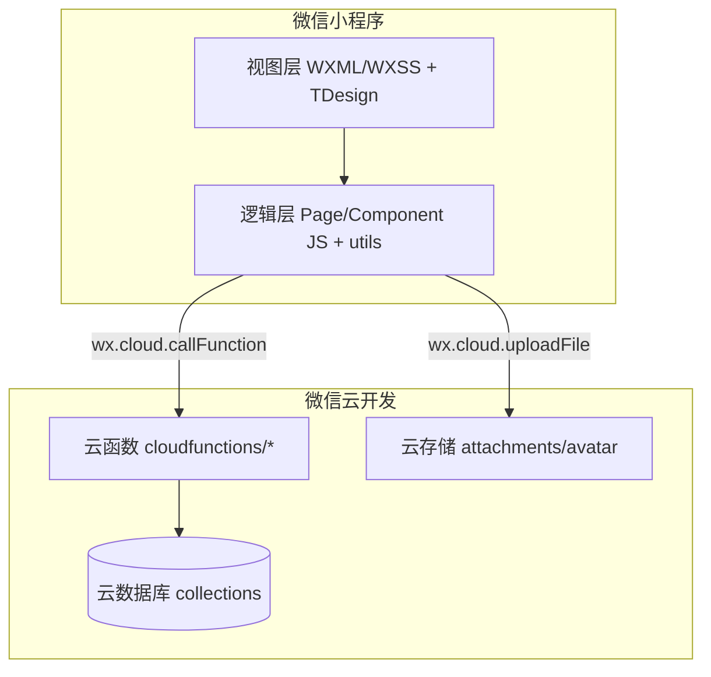

# 班级信息管理系统（微信小程序 + 云开发）

[](https://opensource.org/licenses/MIT)

本仓库是一个面向班级场景的事务管理微信小程序，基于**微信云开发**（云函数/云数据库/云存储）实现“通知、作业、请假、签到、消息汇总”等核心能力，并区分**普通用户**与**班级管理员**两类角色进行权限控制。

> 文档说明：本项目的需求、设计、测试分别见 `第三章 系统需求分析.md`、`第四章 系统设计与实现.md`、`第五章 系统测试与验证.md`。

## ✨ 项目概览

- **登录方式**：系统仅使用微信 OpenID 进行身份识别（不获取微信头像/昵称等个人信息）。
- **主要入口**：TabBar 三个入口 —— **消息**（`pages/home/index`）、**班级**（`pages/message/index`）、**我的**（`pages/my/index`）。
- **技术栈**：
  - **前端**：微信小程序原生开发 + `tdesign-miniprogram`
  - **后端**：微信云开发（云函数、云数据库、云存储）
  - **加密**：AES-256-CBC（前端 `crypto-js` + 云函数 Node `crypto`），并配合 `phone_hash`（SHA-256）用于查询
  - **代码质量**：ESLint + Prettier

## 🚀 功能与角色（与第三章一致）

### 普通用户（member）

- **个人信息**：查看/编辑个人信息（姓名、学号、手机号、学院、专业、头像等）
- **班级管理**：加入班级、隐藏班级（本地）、退出班级
- **通知**：查看通知列表与详情
- **作业**：查看作业、提交作业（支持附件）
- **请假**：提交请假、查看审批状态
- **签到**：签到码签到（4 位数字）
- **消息中心**：汇总查看各班级近一周通知/作业/请假/签到消息，并支持本地归档/删除

### 班级管理员（admin / 创建者）

- **班级管理**：创建班级、班级配置、成员管理（添加/移除/设置管理员等）
- **通知管理**：发布/删除通知
- **作业管理**：发布/删除作业（含删除关联提交）
- **请假审批**：审批请假（同意/拒绝）
- **签到管理**：生成签到码（默认 5 分钟有效期）、查看/删除签到记录
- **消息中心**：从消息中心进入对应管理操作（以实现为准）

> 说明：系统已预留定位签到云函数 `checkInByLocation`，但当前版本页面未开放定位签到入口。

## 🧱 架构与目录（与第四章一致）

### 系统架构（概览）



### 目录结构（核心）

```
.
├── app.js / app.json               # 小程序入口与全局配置
├── pages/                          # 页面（班级/作业/通知/请假/签到/消息等）
├── cloudfunctions/                 # 云函数（业务逻辑、权限校验、加解密）
├── utils/                          # 工具（crypto.js、eventBus.js 等）
├── components/ / custom-tab-bar/   # 自定义组件与 TabBar
├── docs/                           # 辅助设计文档（接口/数据库/实现说明等）
├── 第三章 系统需求分析.md
├── 第四章 系统设计与实现.md
└── 第五章 系统测试与验证.md
```

## 🗄️ 数据库与云函数概览

### 云数据库集合（核心）

- `users`：用户信息（openid、role、加密字段等）
- `courses`：班级信息（班级码、名称、创建者等）
- `course_members`：班级成员与角色（admin/member）
- `notices`：通知
- `assignments`：作业
- `assignment_submissions`：作业提交
- `leave_requests`：请假申请与审批状态
- `checkin_codes`：签到码
- `checkin_records`：签到记录

### 云函数清单（按模块）

- **用户**：`login`、`getUserInfo`、`updateUserInfo`、`register`（预留）
- **班级/成员**：`createClass`、`getClassList`、`getClassDetail`、`updateClass`、`joinClass`、`exitClass`、`getClassMembers`、`addClassMember`、`removeClassMember`、`setClassAdmin`、`unsetClassAdmin`、`checkAdminStatus`
- **通知**：`createNotice`、`getNotices`、`getNoticeDetail`、`deleteNotice`
- **作业**：`createAssignment`、`getAssignments`、`getAssignmentDetail`、`submitAssignment`、`deleteAssignment`
- **请假**：`createLeaveRequest`、`getLeaveRequests`、`getLeaveRequestDetail`、`approveLeaveRequest`
- **签到**：`generateCheckInCode`、`getCheckInCode`、`checkInByCode`、`checkInByLocation`（预留）、`getCheckInRecords`、`deleteCheckInCode`、`updateCheckInStatus`
- **消息中心/文件**：`getMessages`、`getFileTempUrl`

## 🔐 安全、权限与加密（与第三/四/五章一致）

### 权限控制（RBAC）

- 普通用户仅能访问自己加入班级的数据，并仅能操作与自己相关的记录（如自己的作业提交/请假申请）。
- 管理员操作需校验：`course_members.role === 'admin'` 或 `courses.creatorOpenid === openid`。

### 敏感数据加密现状

- **已实现 AES-256-CBC 加密存储**（典型场景）：个人信息更新（姓名、学号、手机号、学院、专业等），以及班级创建时的教师名称等（以云函数实现为准）。
- **部分业务字段当前未加密**：在第三章与第五章中已对“作业提交内容、请假原因、审批意见”等字段的未加密现状进行标注与风险说明（以当前代码为准）。

> 加密细节与使用方式可参考 `README-ENCRYPTION.md` 与 `utils/crypto.js`、各云函数目录下的 `common/aes.js`。

## 🧰 快速上手（本地运行 + 云开发部署）

### 1) 环境准备

- 微信开发者工具（已开通云开发）
- Node.js（建议 16+）
- 一个可用的小程序 AppID（建议使用你自己的 AppID；仓库内 `project.config.json` 中的 appid 仅供参考）

### 2) 安装依赖并构建 npm

在项目根目录执行：

```bash
npm install
```

然后在微信开发者工具中执行：**工具 → 构建 npm**（确保 `crypto-js`、`tdesign-miniprogram` 可被正确引用）。

### 3) 导入小程序项目

微信开发者工具 → 导入项目：

- **项目目录**：仓库根目录
- **AppID**：填写你自己的 AppID
- **开发模式**：小程序

### 4) 配置云开发环境

- 在微信开发者工具的“云开发”中新建环境（Env）
- 在 `app.js` 中初始化云环境（若项目中已做封装，以实际代码为准）

### 5) 部署云函数

云函数位于 `cloudfunctions/`，每个云函数目录均包含 `package.json`。部署建议：

- 方式 A：微信开发者工具中右键 `cloudfunctions` → **上传并部署：云端安装依赖**
- 方式 B：单个云函数目录右键部署（便于分模块更新）

### 6) 初始化云数据库集合与索引（建议）

在云开发控制台创建前述集合，并按第四章/`docs` 中建议配置索引（至少包含 `users.openid` 唯一索引、`course_members(courseId, openid)` 复合索引等）。

## ✅ 测试与验证（第五章摘要）

`第五章 系统测试与验证.md` 已给出：

- 功能测试用例（登录、个人信息加密、班级/通知/作业/请假/签到/消息中心）
- 权限与数据隔离验证点（防越权）
- 性能与兼容性测试要点（页面加载、云函数响应、弱网等）
- 缺陷记录模板与回归策略

## 🧩 常见问题（FAQ）

- **Q：为什么 README 不写手机号/密码登录？**  
  A：系统登录仅使用 OpenID 进行身份识别，详见 `第三章 系统需求分析.md` 的登录用例。

- **Q：是否支持定位签到？**  
  A：当前版本页面未开放定位签到入口，但保留了 `checkInByLocation` 云函数与定位权限声明。

- **Q：为什么仓库里没有注册/找回密码页面？**  
  A：本项目统一采用 OpenID 登录并自动创建用户，不提供手机号+密码注册与找回密码流程。

- **Q：哪些字段做了加密？**  
  A：个人信息等已加密；部分业务字段当前未加密并已在第三/五章标注，详见 `README-ENCRYPTION.md` 与第三章 3.4.2。

## 📄 开源许可

本项目基于 [MIT License](LICENSE) 开源。