# 第三章 系统需求分析
## 3.1 系统用户定义

本系统主要涉及两类用户角色：普通用户和班级管理员。其中，创建班级的用户将自动成为该班级的管理员，并在该班级中拥有管理员权限，但在其他非其创建的班级中，仍将作为普通用户。

### 3.2 用户功能 
当用户以游客身份打开微信小程序时，系统会引导其完成登录或注册，并进行微信授权。用户在注册过程中，需要同意授权微信获取其 OpenID 和昵称，以便系统识别用户身份。注册及授权完成后，用户在后续登录小程序时，无需重复登录操作。授权成功后，用户可以浏览与自身相关的班级事务功能。在个人账户中，用户可查询和修改个人信息；在“消息”界面，可查看班级发布的通知、签到记录以及请假审批等信息；在“班级”界面中，用户可查看其已加入的班级及相关信息，从而实现对班级信息的管理与查看。

图 3-1 用户在系统中的用例图
    

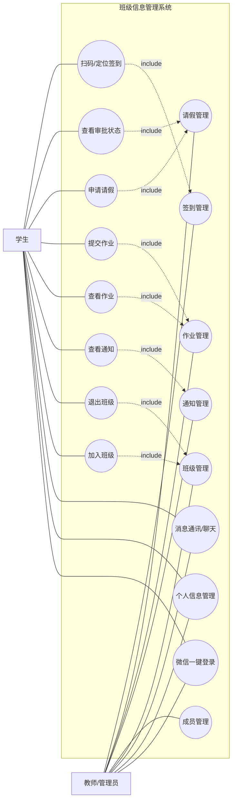
```mermaid
flowchart LR
  %% Mermaid 不支持原生“用例图”语法，这里用 flowchart 表达参与者-用例关系

  Student[学生]
  Teacher[教师/管理员]

  

  subgraph SYS[班级信息管理系统]

    UC_LOGIN((微信一键登录))

    UC_PROFILE((个人信息管理))

    UC_CHAT((消息通讯/聊天))

  

    UC_CLASS((班级管理))

    UC_MEMBER((成员管理))

    UC_NOTICE((通知管理))

    UC_ASSIGN((作业管理))

    UC_LEAVE((请假管理))

    UC_ATTEND((签到管理))

  

    UC_JOIN((加入班级))

    UC_EXIT((退出班级))

    UC_VIEW_NOTICE((查看通知))

    UC_VIEW_ASSIGN((查看作业))

    UC_SUBMIT_ASSIGN((提交作业))

    UC_APPLY_LEAVE((申请请假))

    UC_VIEW_LEAVE((查看审批状态))

    UC_CHECKIN((扫码/定位签到))

  end

  

  Student --- UC_LOGIN

  Student --- UC_PROFILE

  Student --- UC_CHAT

  Student --- UC_JOIN

  Student --- UC_EXIT

  Student --- UC_VIEW_NOTICE

  Student --- UC_VIEW_ASSIGN

  Student --- UC_SUBMIT_ASSIGN

  Student --- UC_APPLY_LEAVE

  Student --- UC_VIEW_LEAVE

  Student --- UC_CHECKIN

  

  Teacher --- UC_LOGIN

  Teacher --- UC_PROFILE

  Teacher --- UC_CHAT

  Teacher --- UC_CLASS

  Teacher --- UC_MEMBER

  Teacher --- UC_NOTICE

  Teacher --- UC_ASSIGN

  Teacher --- UC_LEAVE

  Teacher --- UC_ATTEND

  

  UC_JOIN -. include .-> UC_CLASS

  UC_EXIT -. include .-> UC_CLASS

  UC_VIEW_NOTICE -. include .-> UC_NOTICE

  UC_VIEW_ASSIGN -. include .-> UC_ASSIGN

  UC_SUBMIT_ASSIGN -. include .-> UC_ASSIGN

  UC_APPLY_LEAVE -. include .-> UC_LEAVE

  UC_VIEW_LEAVE -. include .-> UC_LEAVE

  UC_CHECKIN -. include .-> UC_ATTEND

```

#### 3.2.1 用户注册功能

游客打开小程序进入登录页后，系统通过微信云开发能力完成登录校验。系统**仅使用 OpenID 进行身份识别**，不从微信侧获取头像、昵称等个人信息。

- 用例描述：用户登录（OpenID）
- 执行者：用户（学生/教师通用）
- 前置条件：打开系统登录页面并同意相关协议条款
- 后置条件：进入系统主界面并可访问登录后的功能
- 基本路径：
  1. 用户进入登录页面并勾选同意《用户协议》《隐私政策》
  2. 用户点击“微信一键登录”按钮
  3. 前端调用云函数 `login`
  4. 云函数从微信上下文获取 `OPENID`，根据 `openid` 查询用户；若不存在则创建默认用户
  5. 云函数返回 `userId` 与 `role`，前端写入本地缓存并跳转到系统主页
- 扩展路径：
  - 1a. 用户未勾选协议：页面提示并阻止登录操作
  - 4a. 云函数获取 OpenID 失败或执行异常：提示“登录失败/请重试”，停留在当前页面支持重试

用户注册/登录的简要时序图：

  

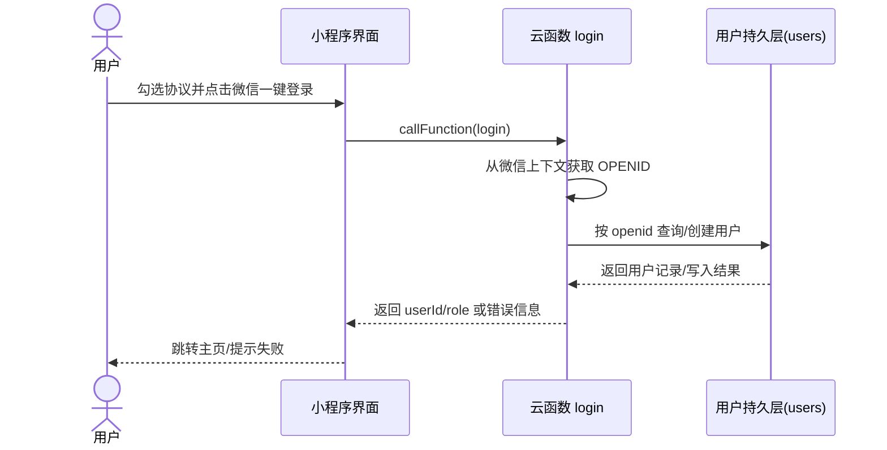
```mermaid

sequenceDiagram

actor 用户

participant 小程序 as 小程序界面

participant 登录 as 云函数 login

participant 数据 as 用户持久层(users)

  

用户->>小程序: 勾选协议并点击微信一键登录

小程序->>登录: callFunction(login)

登录->>登录: 从微信上下文获取 OPENID

登录->>数据: 按 openid 查询/创建用户

数据-->>登录: 返回用户记录/写入结果

登录-->>小程序: 返回 userId/role 或错误信息

小程序-->>用户: 跳转主页/提示失败

```

### 3.2.2 个人信息查询与修改功能

  

- 用例描述：个人信息管理
- 执行者：用户
- 前置条件：用户已登录
- 后置条件：个人信息更新并在“我的”页面展示最新信息
- 基本路径：
  1. 用户进入“我的”页面并打开个人资料编辑
  2. 用户修改头像、姓名、学号、学院、专业、联系方式等信息
  3. 点击保存
  4. 后台校验并更新用户信息
  5. 页面展示新的个人信息

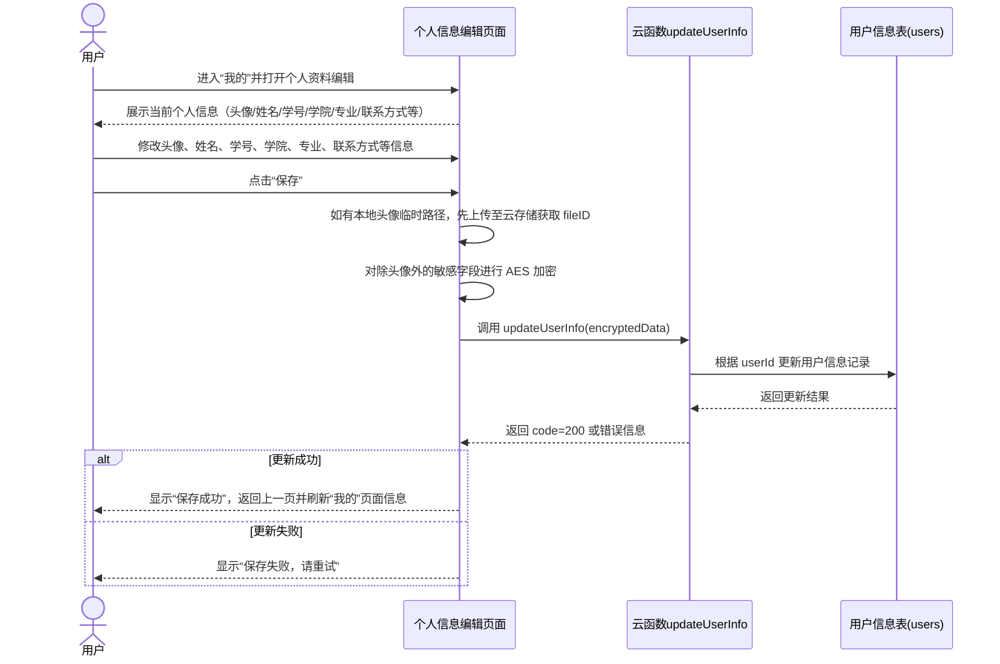
```mermaid

  

sequenceDiagram

  

    actor 用户

  

    participant 页面 as 个人信息编辑页面

  

    participant 云函数 as 云函数updateUserInfo

  

    participant 数据库 as 用户信息表(users)

  

  

    用户->>页面: 进入“我的”并打开个人资料编辑

  

    页面-->>用户: 展示当前个人信息（头像/姓名/学号/学院/专业/联系方式等）

  

  

    用户->>页面: 修改头像、姓名、学号、学院、专业、联系方式等信息

  

    用户->>页面: 点击“保存”

  

  

    页面->>页面: 如有本地头像临时路径，先上传至云存储获取 fileID

  

    页面->>页面: 对除头像外的敏感字段进行 AES 加密

  

    页面->>云函数: 调用 updateUserInfo(encryptedData)

  

    云函数->>数据库: 根据 userId 更新用户信息记录

  

    数据库-->>云函数: 返回更新结果

  

    云函数-->>页面: 返回 code=200 或错误信息

  

  

    alt 更新成功

  

        页面-->>用户: 显示“保存成功”，返回上一页并刷新“我的”页面信息

  

    else 更新失败

  

        页面-->>用户: 显示“保存失败，请重试”

  

    end

  

```

### 3.2.3 加入班级功能

- 用例描述：加入班级
- 执行者：学生
- 前置条件：学生已登录且已完成必要身份信息绑定（若系统要求）
- 后置条件：班级列表新增该班级，学生可访问该班级相关功能
- 基本路径：
  1. 学生进入“班级”页面，点击加入班级
  2. 输入班级码
  3. 前端调用云函数 `joinClass`，后台根据班级码校验班级是否存在、用户是否已加入
  4. 校验通过后，将当前用户写入班级成员表
  5. 前端提示加入成功并刷新班级列表，显示新加入的班级

加入班级功能的简要时序图：

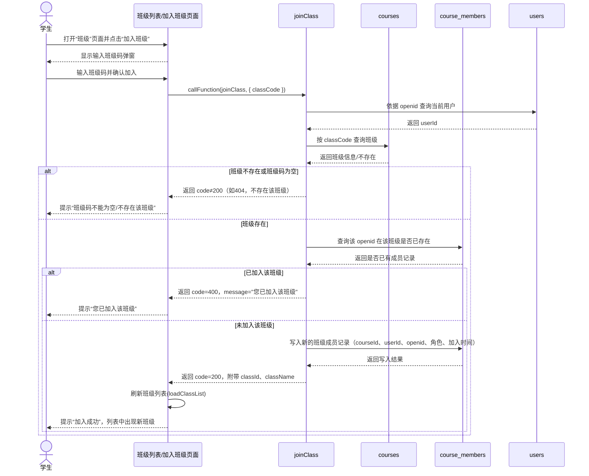
```mermaid
sequenceDiagram
    actor 学生
    participant 页面 as 班级列表/加入班级页面
    participant 云函数 as joinClass
    participant 班级表 as courses
    participant 成员表 as course_members
    participant 用户表 as users

    学生->>页面: 打开“班级”页面并点击“加入班级”
    页面-->>学生: 显示输入班级码弹窗
    学生->>页面: 输入班级码并确认加入

    页面->>云函数: callFunction(joinClass, { classCode })
    云函数->>用户表: 依据 openid 查询当前用户
    用户表-->>云函数: 返回 userId

    云函数->>班级表: 按 classCode 查询班级
    班级表-->>云函数: 返回班级信息/不存在

    alt 班级不存在或班级码为空
        云函数-->>页面: 返回 code≠200（如404，不存在该班级）
        页面-->>学生: 提示“班级码不能为空/不存在该班级”
    else 班级存在
        云函数->>成员表: 查询该 openid 在该班级是否已存在
        成员表-->>云函数: 返回是否已有成员记录

        alt 已加入该班级
            云函数-->>页面: 返回 code=400，message="您已加入该班级"
            页面-->>学生: 提示“您已加入该班级”
        else 未加入该班级
            云函数->>成员表: 写入新的班级成员记录（courseId、userId、openid、角色、加入时间）
            成员表-->>云函数: 返回写入结果
            云函数-->>页面: 返回 code=200，附带 classId、className
            页面->>页面: 刷新班级列表(loadClassList)
            页面-->>学生: 提示“加入成功”，列表中出现新班级
        end
    end
```

#### 3.2.3.1 隐藏班级功能

- 用例描述：隐藏班级
- 执行者：学生
- 前置条件：学生已登录，且已加入目标班级；用户进入班级信息页面
- 后置条件：目标班级在班级列表中被隐藏（仅本地生效，不影响班级成员关系），可在“隐藏班级”入口中恢复显示
- 基本路径：
  1. 学生进入班级信息页面，点击“隐藏班级”
  2. 系统弹出确认对话框
  3. 学生确认隐藏
  4. 前端将该班级 `classId` 写入本地存储 `hiddenClassIds`
  5. 返回班级列表页面，列表页根据 `hiddenClassIds` 隐藏该班级卡片
- 扩展路径：
  - 3a. 学生取消操作：不写入本地存储，页面保持不变

隐藏班级功能的简要时序图：

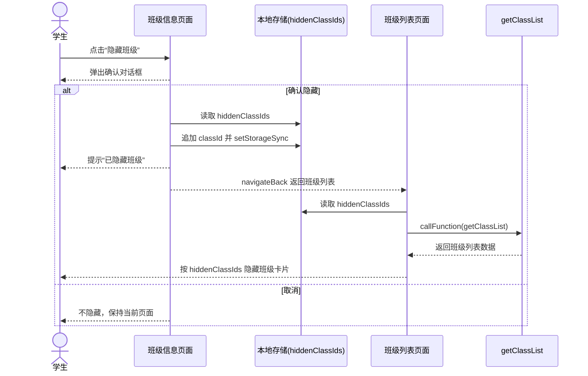
```mermaid
sequenceDiagram
    actor 学生
    participant 信息页 as 班级信息页面
    participant 存储 as 本地存储(hiddenClassIds)
    participant 列表页 as 班级列表页面
    participant 云函数 as getClassList

    学生->>信息页: 点击“隐藏班级”
    信息页-->>学生: 弹出确认对话框
    alt 确认隐藏
        信息页->>存储: 读取 hiddenClassIds
        信息页->>存储: 追加 classId 并 setStorageSync
        信息页-->>学生: 提示“已隐藏班级”
        信息页-->>列表页: navigateBack 返回班级列表
        列表页->>存储: 读取 hiddenClassIds
        列表页->>云函数: callFunction(getClassList)
        云函数-->>列表页: 返回班级列表数据
        列表页-->>学生: 按 hiddenClassIds 隐藏班级卡片
    else 取消
        信息页-->>学生: 不隐藏，保持当前页面
    end
```

#### 3.2.3.2 退出班级功能

- 用例描述：退出班级
- 执行者：学生
- 前置条件：学生已登录，且已加入目标班级；用户进入班级信息页面
- 后置条件：删除该学生与班级的成员关系；返回班级列表后不再显示该班级
- 基本路径：
  1. 学生进入班级信息页面，点击“退出班级”
  2. 系统弹出确认对话框
  3. 学生确认退出，前端调用云函数 `exitClass(classId)`
  4. 云函数从微信上下文获取 `OPENID`，在成员表中查找该用户与班级的成员记录
  5. 删除成员记录并返回退出结果
  6. 前端提示退出成功并返回班级列表，列表页重新加载后不再显示该班级
- 扩展路径：
  - 3a. 学生取消操作：不调用云函数，页面保持不变
  - 5a. 云函数未找到成员记录：返回“您未加入该班级”，前端提示后停留在当前页面

退出班级功能的简要时序图：

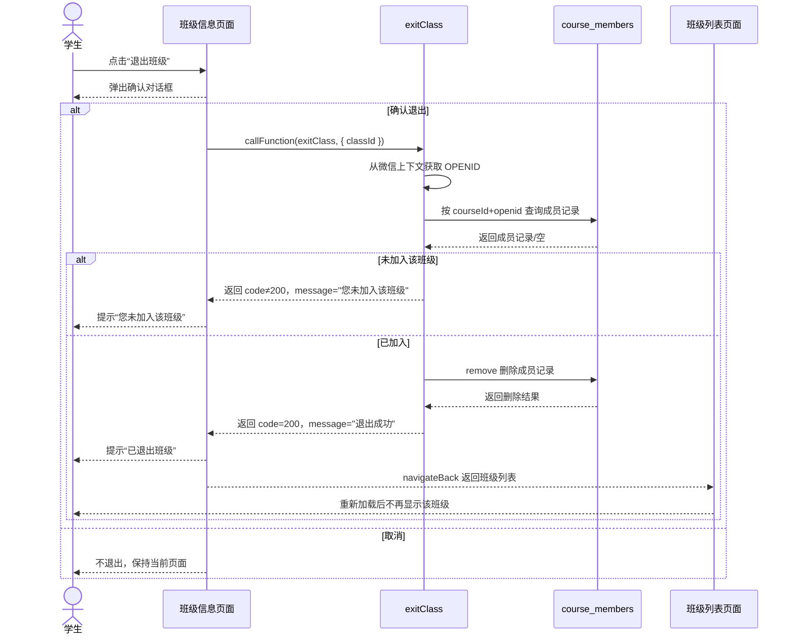
```mermaid
sequenceDiagram
    actor 学生
    participant 信息页 as 班级信息页面
    participant 云函数 as exitClass
    participant 成员表 as course_members
    participant 列表页 as 班级列表页面

    学生->>信息页: 点击“退出班级”
    信息页-->>学生: 弹出确认对话框
    alt 确认退出
        信息页->>云函数: callFunction(exitClass, { classId })
        云函数->>云函数: 从微信上下文获取 OPENID
        云函数->>成员表: 按 courseId+openid 查询成员记录
        成员表-->>云函数: 返回成员记录/空
        alt 未加入该班级
            云函数-->>信息页: 返回 code≠200，message="您未加入该班级"
            信息页-->>学生: 提示“您未加入该班级”
        else 已加入
            云函数->>成员表: remove 删除成员记录
            成员表-->>云函数: 返回删除结果
            云函数-->>信息页: 返回 code=200，message="退出成功"
            信息页-->>学生: 提示“已退出班级”
            信息页-->>列表页: navigateBack 返回班级列表
            列表页-->>学生: 重新加载后不再显示该班级
        end
    else 取消
        信息页-->>学生: 不退出，保持当前页面
    end
```

### 3.2.4 作业提交功能

- 用例描述：提交作业
- 执行者：用户
- 前置条件：学生已加入班级且作业在截止时间内
- 后置条件：系统记录学生提交内容/附件并更新提交状态
- 基本路径：
  1. 学生进入作业列表并打开指定作业详情
  2. 填写作业内容/上传附件
  3. 点击提交
  4. 后台保存作业提交记录
  5. 页面显示“已提交”状态与提交时间

作业提交功能的简要时序图：

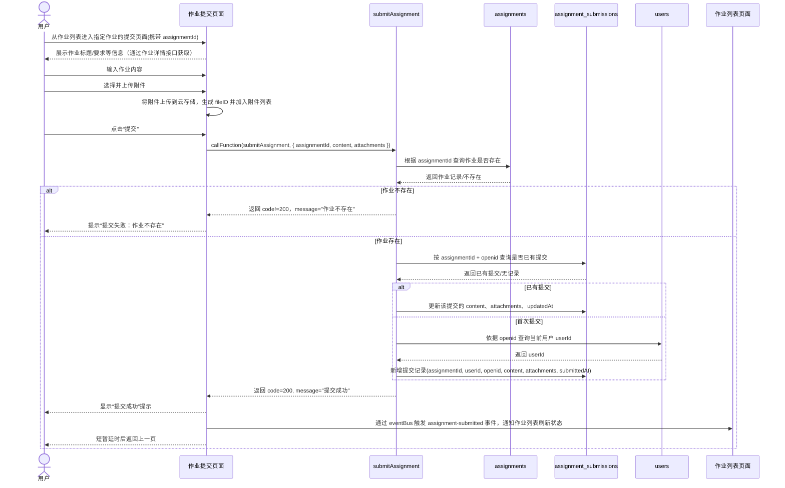
```mermaid
sequenceDiagram
    actor 用户
    participant 提交页 as 作业提交页面
    participant 云函数 as submitAssignment
    participant 作业表 as assignments
    participant 提交表 as assignment_submissions
    participant 用户表 as users
    participant 其他页 as 作业列表页面

    用户->>提交页: 从作业列表进入指定作业的提交页面(携带 assignmentId)
    提交页-->>用户: 展示作业标题/要求等信息（通过作业详情接口获取）

    用户->>提交页: 输入作业内容
    用户->>提交页: 选择并上传附件
    提交页->>提交页: 将附件上传到云存储，生成 fileID 并加入附件列表

    用户->>提交页: 点击“提交”
    提交页->>云函数: callFunction(submitAssignment, { assignmentId, content, attachments })

    云函数->>作业表: 根据 assignmentId 查询作业是否存在
    作业表-->>云函数: 返回作业记录/不存在

    alt 作业不存在
        云函数-->>提交页: 返回 code!=200，message="作业不存在"
        提交页-->>用户: 提示“提交失败：作业不存在”
    else 作业存在
        云函数->>提交表: 按 assignmentId + openid 查询是否已有提交
        提交表-->>云函数: 返回已有提交/无记录

        alt 已有提交
            云函数->>提交表: 更新该提交的 content、attachments、updatedAt
        else 首次提交
            云函数->>用户表: 依据 openid 查询当前用户 userId
            用户表-->>云函数: 返回 userId
            云函数->>提交表: 新增提交记录(assignmentId, userId, openid, content, attachments, submittedAt)
        end

        云函数-->>提交页: 返回 code=200, message="提交成功"
        提交页-->>用户: 显示“提交成功”提示
        提交页->>其他页: 通过 eventBus 触发 assignment-submitted 事件，通知作业列表刷新状态
        提交页-->>用户: 短暂延时后返回上一页
    end
```

### 3.2.5 请假申请功能

- 用例描述：提交请假申请
- 执行者：学生
- 前置条件：学生已加入班级
- 后置条件：生成请假记录并进入待审批状态，消息中心产生提醒
- 基本路径：
  1. 学生进入请假页面，点击新建请假
  2. 填写请假日期、原因、上传证明（可选）
  3. 点击提交
  4. 后台保存请假申请（状态为待审批），教师端可在请假列表/消息中心查看待审批记录
  5. 返回请假列表页面，页面重新加载并显示请假记录与审批状态

请假申请功能的简要时序图：

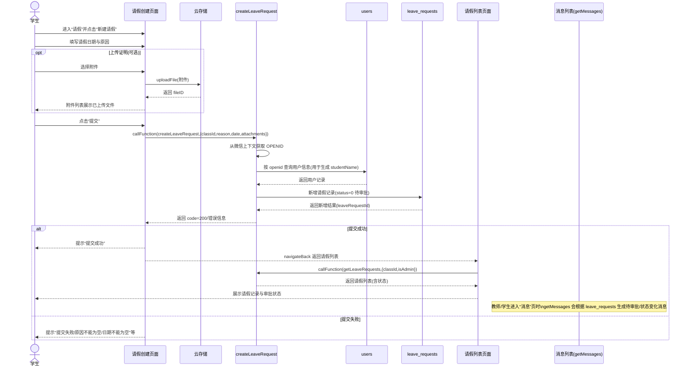
```mermaid
sequenceDiagram
    actor 学生
    participant 创建页 as 请假创建页面
    participant 云存储 as 云存储
    participant 云函数 as createLeaveRequest
    participant 用户表 as users
    participant 请假表 as leave_requests
    participant 列表页 as 请假列表页面
    participant 消息页 as 消息列表(getMessages)

    学生->>创建页: 进入“请假”并点击“新建请假”
    学生->>创建页: 填写请假日期与原因
    opt 上传证明(可选)
        学生->>创建页: 选择附件
        创建页->>云存储: uploadFile(附件)
        云存储-->>创建页: 返回 fileID
        创建页-->>学生: 附件列表展示已上传文件
    end

    学生->>创建页: 点击“提交”
    创建页->>云函数: callFunction(createLeaveRequest,{classId,reason,date,attachments})
    云函数->>云函数: 从微信上下文获取 OPENID
    云函数->>用户表: 按 openid 查询用户信息(用于生成 studentName)
    用户表-->>云函数: 返回用户记录
    云函数->>请假表: 新增请假记录(status=0 待审批)
    请假表-->>云函数: 返回新增结果(leaveRequestId)
    云函数-->>创建页: 返回 code=200/错误信息

    alt 提交成功
        创建页-->>学生: 提示“提交成功”
        创建页-->>列表页: navigateBack 返回请假列表
        列表页->>云函数: callFunction(getLeaveRequests,{classId,isAdmin})
        云函数-->>列表页: 返回请假列表(含状态)
        列表页-->>学生: 展示请假记录与审批状态
        note over 消息页: 教师/学生进入“消息”页时\ngetMessages 会根据 leave_requests 生成待审批/状态变化消息
    else 提交失败
        创建页-->>学生: 提示“提交失败/原因不能为空/日期不能为空”等
    end
```

### 3.2.6 签到功能

- 用例描述：签到码签到（4位数字）
- 执行者：学生
- 前置条件：管理员已生成有效签到码（默认有效期 5 分钟）；学生已登录并进入签到页面
- 后置条件：生成签到记录并更新签到状态，消息中心对应“签到通知”不再提示未签到
- 基本路径：
  1. 学生进入签到页面/签到任务入口
  2. 输入 4 位签到码并点击确认签到
  3. 后台校验签到码有效性与有效期，并校验是否重复签到
  4. 后台写入签到记录（签到方式为签到码）
  5. 页面提示签到成功并清空输入

签到功能的简要时序图：

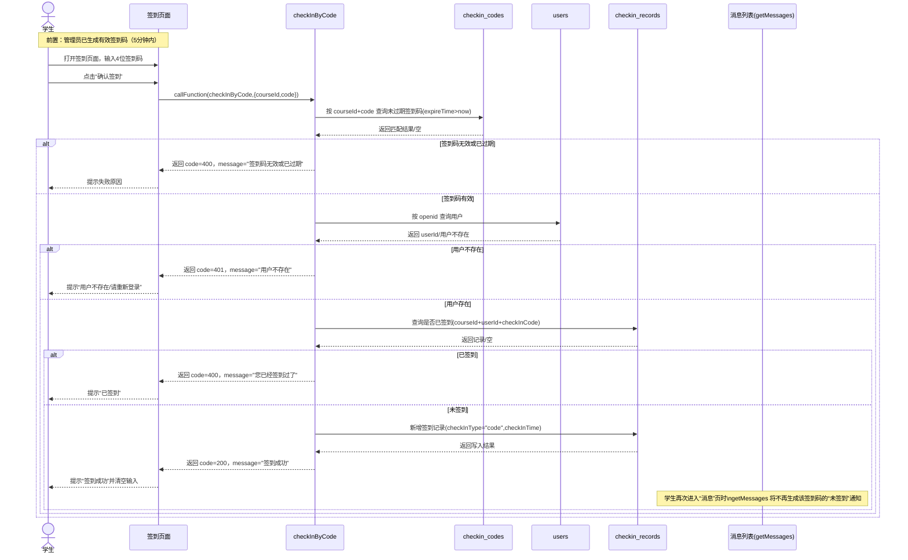
```mermaid
sequenceDiagram
    actor 学生
    participant 页面 as 签到页面
    participant 云函数 as checkInByCode
    participant 码表 as checkin_codes
    participant 用户表 as users
    participant 记录表 as checkin_records
    participant 消息页 as 消息列表(getMessages)

    note over 学生,页面: 前置：管理员已生成有效签到码（5分钟内）
    学生->>页面: 打开签到页面，输入4位签到码
    学生->>页面: 点击“确认签到”
    页面->>云函数: callFunction(checkInByCode,{courseId,code})

    云函数->>码表: 按 courseId+code 查询未过期签到码(expireTime>now)
    码表-->>云函数: 返回匹配结果/空
    alt 签到码无效或已过期
        云函数-->>页面: 返回 code=400，message="签到码无效或已过期"
        页面-->>学生: 提示失败原因
    else 签到码有效
        云函数->>用户表: 按 openid 查询用户
        用户表-->>云函数: 返回 userId/用户不存在
        alt 用户不存在
            云函数-->>页面: 返回 code=401，message="用户不存在"
            页面-->>学生: 提示“用户不存在/请重新登录”
        else 用户存在
            云函数->>记录表: 查询是否已签到(courseId+userId+checkInCode)
            记录表-->>云函数: 返回记录/空
            alt 已签到
                云函数-->>页面: 返回 code=400，message="您已经签到过了"
                页面-->>学生: 提示“已签到”
            else 未签到
                云函数->>记录表: 新增签到记录(checkInType="code",checkInTime)
                记录表-->>云函数: 返回写入结果
                云函数-->>页面: 返回 code=200，message="签到成功"
                页面-->>学生: 提示“签到成功”并清空输入
                note over 消息页: 学生再次进入“消息”页时\ngetMessages 将不再生成该签到码的“未签到”通知
            end
        end
    end
```

> 说明：系统已预留定位签到云函数 `checkInByLocation`，但当前签到页面未开放定位签到入口。

### 3.2.7 消息中心功能

- 用例描述：查看各班级消息汇总
- 执行者：学生
- 前置条件：学生已登录并已加入至少一个班级
- 后置条件：学生可在消息中心查看所有班级的通知、作业、请假、签到等消息汇总，并可点击跳转到对应详情页
- 基本路径：
  1. 学生进入“消息”页面（TabBar 第一个入口）
  2. 前端调用云函数 `getMessages`，云函数汇总该学生所有班级的近一周消息（通知、作业、请假、签到等）
  3. 页面按时间倒序展示消息列表，每条消息显示班级名称、消息类型、标题、内容摘要、时间
  4. 学生点击某条消息，根据消息类型跳转到对应的详情页（通知详情/作业详情/请假详情/签到页面）
  5. 学生可对消息进行归档或删除操作（仅本地生效）

消息中心功能的简要时序图：

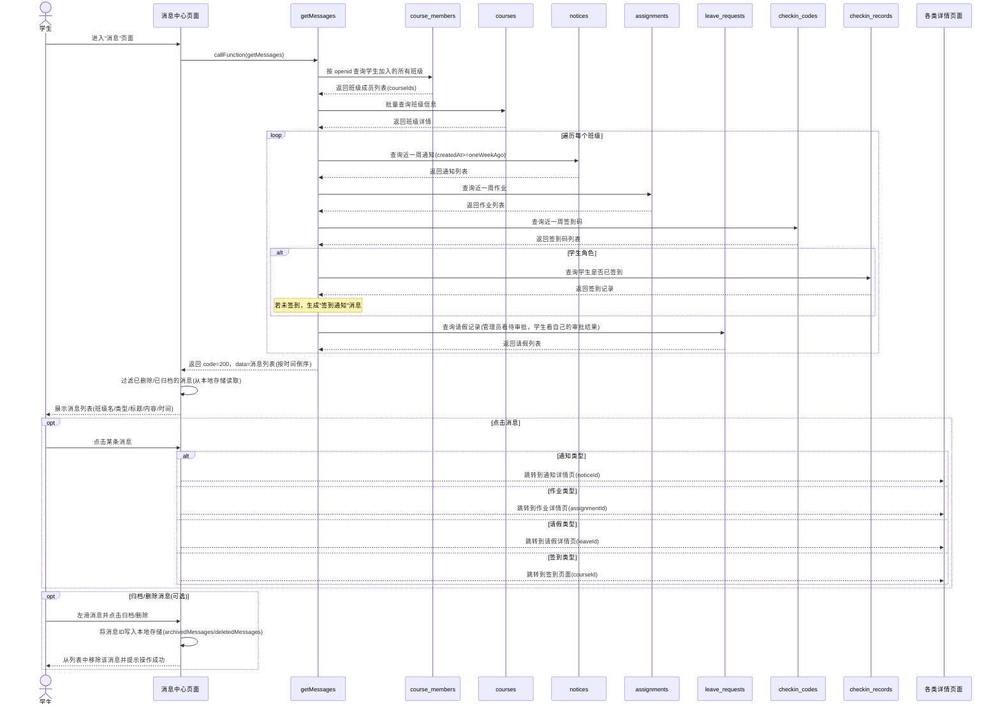
```mermaid
sequenceDiagram
    actor 学生
    participant 消息页 as 消息中心页面
    participant 云函数 as getMessages
    participant 成员表 as course_members
    participant 班级表 as courses
    participant 通知表 as notices
    participant 作业表 as assignments
    participant 请假表 as leave_requests
    participant 签到码表 as checkin_codes
    participant 签到记录表 as checkin_records
    participant 详情页 as 各类详情页面

    学生->>消息页: 进入“消息”页面
    消息页->>云函数: callFunction(getMessages)
    云函数->>成员表: 按 openid 查询学生加入的所有班级
    成员表-->>云函数: 返回班级成员列表(courseIds)
    云函数->>班级表: 批量查询班级信息
    班级表-->>云函数: 返回班级详情

    loop 遍历每个班级
        云函数->>通知表: 查询近一周通知(createdAt>=oneWeekAgo)
        通知表-->>云函数: 返回通知列表
        云函数->>作业表: 查询近一周作业
        作业表-->>云函数: 返回作业列表
        云函数->>签到码表: 查询近一周签到码
        签到码表-->>云函数: 返回签到码列表
        alt 学生角色
            云函数->>签到记录表: 查询学生是否已签到
            签到记录表-->>云函数: 返回签到记录
            note over 云函数: 若未签到，生成"签到通知"消息
        end
        云函数->>请假表: 查询请假记录(管理员看待审批，学生看自己的审批结果)
        请假表-->>云函数: 返回请假列表
    end

    云函数-->>消息页: 返回 code=200，data=消息列表(按时间倒序)
    消息页->>消息页: 过滤已删除/已归档的消息(从本地存储读取)
    消息页-->>学生: 展示消息列表(班级名/类型/标题/内容/时间)

    opt 点击消息
        学生->>消息页: 点击某条消息
        alt 通知类型
            消息页-->>详情页: 跳转到通知详情页(noticeId)
        else 作业类型
            消息页-->>详情页: 跳转到作业详情页(assignmentId)
        else 请假类型
            消息页-->>详情页: 跳转到请假详情页(leaveId)
        else 签到类型
            消息页-->>详情页: 跳转到签到页面(courseId)
        end
    end

    opt 归档/删除消息(可选)
        学生->>消息页: 左滑消息并点击归档/删除
        消息页->>消息页: 将消息ID写入本地存储(archivedMessages/deletedMessages)
        消息页-->>学生: 从列表中移除该消息并提示操作成功
    end
```

## 3.3 管理员功能需求（教师/班级管理员）

教师创建班级后自动成为该班级的管理员，拥有该班级的管理权限。管理员可在班级相关页面进行事务管理操作，包括班级信息配置、成员管理、通知发布与删除、作业发布与批改、请假审批、签到码生成与记录查看、数据统计等。管理员权限仅作用于其创建或被设置为管理员的班级，在其他班级中仍作为普通成员。

### 3.3.1 班级创建功能

- 用例描述：创建班级
- 执行者：教师
- 前置条件：教师已登录
- 后置条件：系统生成班级信息与班级码，教师自动成为该班级管理员，班级出现在班级列表中
- 基本路径：
  1. 教师进入班级列表页面，点击“创建班级”入口
  2. 填写班级名称、老师名称、学期等信息
  3. 前端生成 6 位随机班级码（数字+大写英文）
  4. 前端对老师名称进行 AES 加密后，调用云函数 `createClass`
  5. 云函数校验班级码唯一性，创建班级记录并将创建者添加为管理员
  6. 前端显示班级码弹窗，返回班级列表并刷新

班级创建功能的简要时序图：

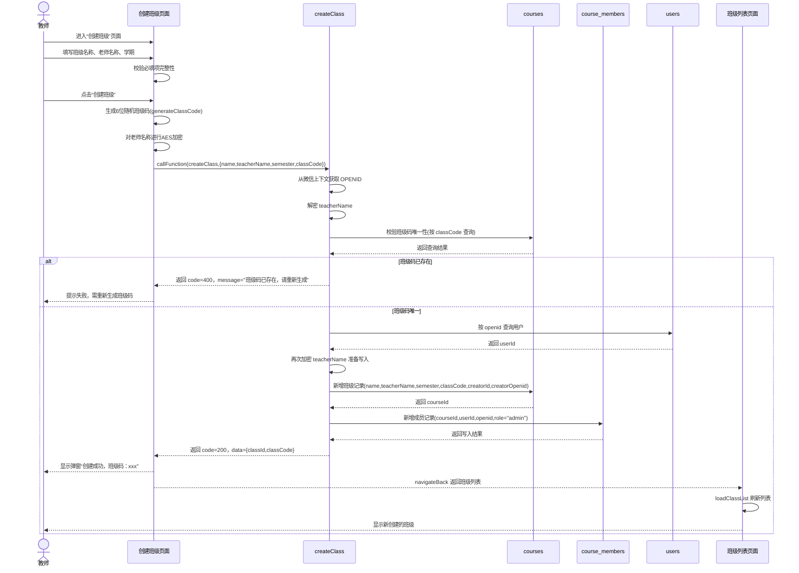
```mermaid
sequenceDiagram
    actor 教师
    participant 创建页 as 创建班级页面
    participant 云函数 as createClass
    participant 班级表 as courses
    participant 成员表 as course_members
    participant 用户表 as users
    participant 列表页 as 班级列表页面

    教师->>创建页: 进入“创建班级”页面
    教师->>创建页: 填写班级名称、老师名称、学期
    创建页->>创建页: 校验必填项完整性
    教师->>创建页: 点击“创建班级”
    创建页->>创建页: 生成6位随机班级码(generateClassCode)
    创建页->>创建页: 对老师名称进行AES加密
    创建页->>云函数: callFunction(createClass,{name,teacherName,semester,classCode})

    云函数->>云函数: 从微信上下文获取 OPENID
    云函数->>云函数: 解密 teacherName
    云函数->>班级表: 校验班级码唯一性(按 classCode 查询)
    班级表-->>云函数: 返回查询结果

    alt 班级码已存在
        云函数-->>创建页: 返回 code=400，message="班级码已存在，请重新生成"
        创建页-->>教师: 提示失败，需重新生成班级码
    else 班级码唯一
        云函数->>用户表: 按 openid 查询用户
        用户表-->>云函数: 返回 userId
        云函数->>云函数: 再次加密 teacherName 准备写入
        云函数->>班级表: 新增班级记录(name,teacherName,semester,classCode,creatorId,creatorOpenid)
        班级表-->>云函数: 返回 courseId
        云函数->>成员表: 新增成员记录(courseId,userId,openid,role="admin")
        成员表-->>云函数: 返回写入结果
        云函数-->>创建页: 返回 code=200，data={classId,classCode}
        创建页-->>教师: 显示弹窗“创建成功，班级码：xxx”
        创建页-->>列表页: navigateBack 返回班级列表
        列表页->>列表页: loadClassList 刷新列表
        列表页-->>教师: 显示新创建的班级
    end
```

### 3.3.2 成员管理功能（添加/移除/设置管理员）

- 用例描述：成员管理
- 执行者：管理员
- 前置条件：管理员已进入班级成员列表页面
- 后置条件：成员列表更新并重新载入，成员关系或权限已变更
- 基本路径（以移除成员为例）：
  1. 管理员进入班级成员列表页面
  2. 选择特定成员，点击“删除成员”按钮
  3. 系统弹出确认对话框
  4. 管理员确认删除，前端调用云函数 `removeClassMember`
  5. 云函数校验管理员权限，删除成员关系记录
  6. 前端刷新成员列表，显示更新后的列表

成员管理功能的简要时序图（移除成员）：

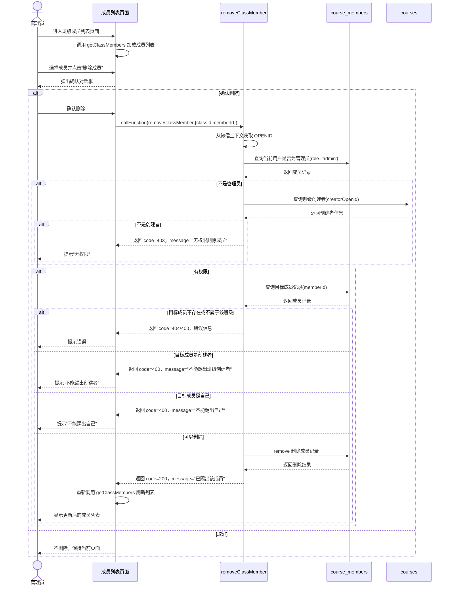
```mermaid
sequenceDiagram
    actor 管理员
    participant 成员页 as 成员列表页面
    participant 云函数 as removeClassMember
    participant 成员表 as course_members
    participant 班级表 as courses

    管理员->>成员页: 进入班级成员列表页面
    成员页->>成员页: 调用 getClassMembers 加载成员列表
    管理员->>成员页: 选择成员并点击“删除成员”
    成员页-->>管理员: 弹出确认对话框
    alt 确认删除
        管理员->>成员页: 确认删除
        成员页->>云函数: callFunction(removeClassMember,{classId,memberId})
        云函数->>云函数: 从微信上下文获取 OPENID
        云函数->>成员表: 查询当前用户是否为管理员(role='admin')
        成员表-->>云函数: 返回成员记录
        alt 不是管理员
            云函数->>班级表: 查询班级创建者(creatorOpenid)
            班级表-->>云函数: 返回创建者信息
            alt 不是创建者
                云函数-->>成员页: 返回 code=403，message="无权限删除成员"
                成员页-->>管理员: 提示“无权限”
            end
        end
        alt 有权限
            云函数->>成员表: 查询目标成员记录(memberId)
            成员表-->>云函数: 返回成员记录
            alt 目标成员不存在或不属于该班级
                云函数-->>成员页: 返回 code=404/400，错误信息
                成员页-->>管理员: 提示错误
            else 目标成员是创建者
                云函数-->>成员页: 返回 code=400，message="不能踢出班级创建者"
                成员页-->>管理员: 提示“不能踢出创建者”
            else 目标成员是自己
                云函数-->>成员页: 返回 code=400，message="不能踢出自己"
                成员页-->>管理员: 提示“不能踢出自己”
            else 可以删除
                云函数->>成员表: remove 删除成员记录
                成员表-->>云函数: 返回删除结果
                云函数-->>成员页: 返回 code=200，message="已踢出该成员"
                成员页->>成员页: 重新调用 getClassMembers 刷新列表
                成员页-->>管理员: 显示更新后的成员列表
            end
        end
    else 取消
        成员页-->>管理员: 不删除，保持当前页面
    end
```

> 说明：成员管理还包括**添加成员**（通过学号搜索并添加）、**设置管理员**（将普通成员提升为管理员）、**取消管理员**（将管理员降级为普通成员，不踢出班级）等功能，流程类似，均需校验管理员权限。

### 3.3.3 通知公告发布功能

- 用例描述：发布通知公告
- 执行者：管理员
- 前置条件：管理员进入班级通知页面
- 后置条件：生成新的通知记录并在成员端可见，消息中心产生提醒
- 基本路径：
  1. 管理员进入班级通知列表页面，点击“发布通知”
  2. 填写通知标题、正文，可选择上传附件
  3. 点击“发布”按钮
  4. 前端调用云函数 `createNotice`，云函数校验管理员权限并保存通知信息
  5. 返回通知列表页面，页面重新加载并显示新发布的通知

通知公告发布功能的简要时序图：

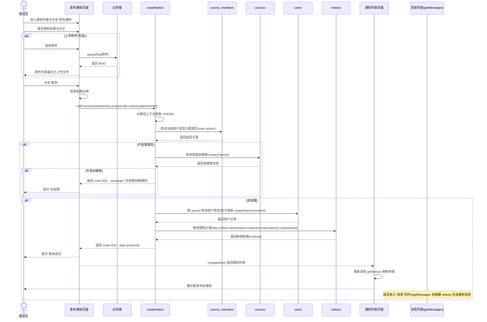
```mermaid
sequenceDiagram
    actor 管理员
    participant 创建页 as 发布通知页面
    participant 云存储 as 云存储
    participant 云函数 as createNotice
    participant 成员表 as course_members
    participant 班级表 as courses
    participant 用户表 as users
    participant 通知表 as notices
    participant 列表页 as 通知列表页面
    participant 消息页 as 消息列表(getMessages)

    管理员->>创建页: 进入通知列表并点击“发布通知”
    管理员->>创建页: 填写通知标题与正文
    opt 上传附件(可选)
        管理员->>创建页: 选择附件
        创建页->>云存储: uploadFile(附件)
        云存储-->>创建页: 返回 fileID
        创建页-->>管理员: 附件列表展示已上传文件
    end

    管理员->>创建页: 点击“发布”
    创建页->>创建页: 校验标题必填
    创建页->>云函数: callFunction(createNotice,{classId,title,content,attachments})
    云函数->>云函数: 从微信上下文获取 OPENID
    云函数->>成员表: 查询当前用户是否为管理员(role='admin')
    成员表-->>云函数: 返回成员记录
    alt 不是管理员
        云函数->>班级表: 查询班级创建者(creatorOpenid)
        班级表-->>云函数: 返回创建者信息
        alt 不是创建者
            云函数-->>创建页: 返回 code=403，message="无权限创建通知"
            创建页-->>管理员: 提示“无权限”
        end
    end
    alt 有权限
        云函数->>用户表: 按 openid 查询用户信息(用于获取 creatorName/creatorId)
        用户表-->>云函数: 返回用户记录
        云函数->>通知表: 新增通知记录(title,content,attachments,creatorId,creatorOpenid,creatorName)
        通知表-->>云函数: 返回新增结果(noticeId)
        云函数-->>创建页: 返回 code=200，data={noticeId}
        创建页-->>管理员: 提示“发布成功”
        创建页-->>列表页: navigateBack 返回通知列表
        列表页->>列表页: 重新调用 getNotices 刷新列表
        列表页-->>管理员: 展示新发布的通知
        note over 消息页: 成员进入“消息”页时\ngetMessages 会根据 notices 生成通知消息
    end
```

### 3.3.4 管理员“信息删除”功能（以作业/通知为例）

参考“活动删除功能”的体例，本项目中对应的“信息删除”主要发生在**通知**与**作业**等管理员发布内容上：管理员登录后，查询信息列表，选择特定信息进行删除，系统删除后重新载入列表。

#### 3.3.4.1 通知删除功能

- 用例描述：通知删除功能
- 执行者：管理员或通知创建者
- 前置条件：管理员已登录并进入班级通知列表页面
- 后置条件：通知被删除，通知列表重新载入
- 基本路径：
  1. 管理员进入班级通知列表页面
  2. 左滑需要删除的通知，点击删除按钮
  3. 系统弹出确认对话框
  4. 管理员确认删除，前端调用云函数 `deleteNotice`
  5. 云函数校验权限（管理员或创建者），删除通知记录
  6. 前端刷新通知列表，显示更新后的列表

通知删除功能的简要时序图：

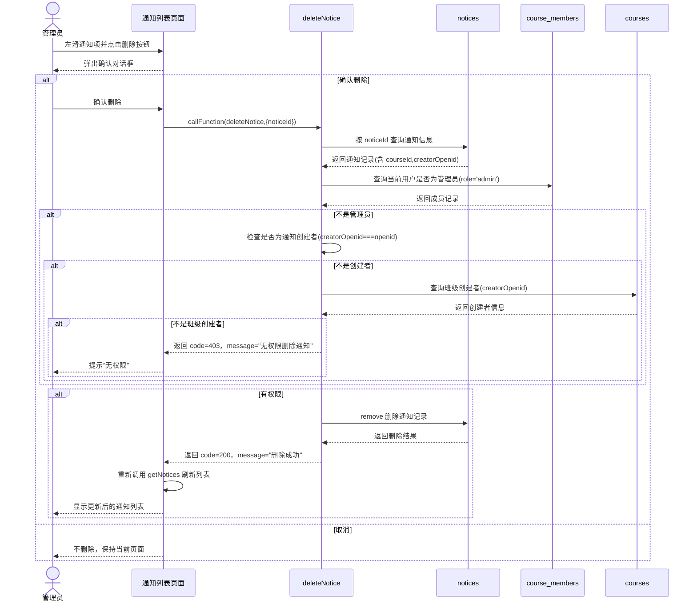
```mermaid
sequenceDiagram
    actor 管理员
    participant 列表页 as 通知列表页面
    participant 云函数 as deleteNotice
    participant 通知表 as notices
    participant 成员表 as course_members
    participant 班级表 as courses

    管理员->>列表页: 左滑通知项并点击删除按钮
    列表页-->>管理员: 弹出确认对话框
    alt 确认删除
        管理员->>列表页: 确认删除
        列表页->>云函数: callFunction(deleteNotice,{noticeId})
        云函数->>通知表: 按 noticeId 查询通知信息
        通知表-->>云函数: 返回通知记录(含 courseId,creatorOpenid)
        云函数->>成员表: 查询当前用户是否为管理员(role='admin')
        成员表-->>云函数: 返回成员记录
        alt 不是管理员
            云函数->>云函数: 检查是否为通知创建者(creatorOpenid===openid)
            alt 不是创建者
                云函数->>班级表: 查询班级创建者(creatorOpenid)
                班级表-->>云函数: 返回创建者信息
                alt 不是班级创建者
                    云函数-->>列表页: 返回 code=403，message="无权限删除通知"
                    列表页-->>管理员: 提示“无权限”
                end
            end
        end
        alt 有权限
            云函数->>通知表: remove 删除通知记录
            通知表-->>云函数: 返回删除结果
            云函数-->>列表页: 返回 code=200，message="删除成功"
            列表页->>列表页: 重新调用 getNotices 刷新列表
            列表页-->>管理员: 显示更新后的通知列表
        end
    else 取消
        列表页-->>管理员: 不删除，保持当前页面
    end
```

#### 3.3.4.2 作业删除功能

- 用例描述：作业删除功能
- 执行者：管理员或作业创建者
- 前置条件：管理员已登录并进入班级作业列表页面
- 后置条件：作业及相关的提交记录被删除，作业列表重新载入
- 基本路径：
  1. 管理员进入班级作业列表页面
  2. 左滑需要删除的作业，点击删除按钮
  3. 系统弹出确认对话框
  4. 管理员确认删除，前端调用云函数 `deleteAssignment`
  5. 云函数校验权限（管理员或创建者），删除作业记录并批量删除相关提交记录
  6. 前端刷新作业列表，显示更新后的列表

作业删除功能的简要时序图：

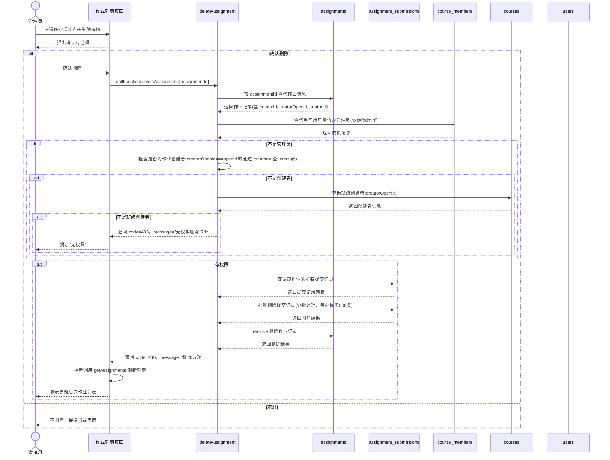
```mermaid
sequenceDiagram
    actor 管理员
    participant 列表页 as 作业列表页面
    participant 云函数 as deleteAssignment
    participant 作业表 as assignments
    participant 提交表 as assignment_submissions
    participant 成员表 as course_members
    participant 班级表 as courses
    participant 用户表 as users

    管理员->>列表页: 左滑作业项并点击删除按钮
    列表页-->>管理员: 弹出确认对话框
    alt 确认删除
        管理员->>列表页: 确认删除
        列表页->>云函数: callFunction(deleteAssignment,{assignmentId})
        云函数->>作业表: 按 assignmentId 查询作业信息
        作业表-->>云函数: 返回作业记录(含 courseId,creatorOpenid,creatorId)
        云函数->>成员表: 查询当前用户是否为管理员(role='admin')
        成员表-->>云函数: 返回成员记录
        alt 不是管理员
            云函数->>云函数: 检查是否为作业创建者(creatorOpenid===openid 或通过 creatorId 查 users 表)
            alt 不是创建者
                云函数->>班级表: 查询班级创建者(creatorOpenid)
                班级表-->>云函数: 返回创建者信息
                alt 不是班级创建者
                    云函数-->>列表页: 返回 code=403，message="无权限删除作业"
                    列表页-->>管理员: 提示“无权限”
                end
            end
        end
        alt 有权限
            云函数->>提交表: 查询该作业的所有提交记录
            提交表-->>云函数: 返回提交记录列表
            云函数->>提交表: 批量删除提交记录(分批处理，每批最多500条)
            提交表-->>云函数: 返回删除结果
            云函数->>作业表: remove 删除作业记录
            作业表-->>云函数: 返回删除结果
            云函数-->>列表页: 返回 code=200，message="删除成功"
            列表页->>列表页: 重新调用 getAssignments 刷新列表
            列表页-->>管理员: 显示更新后的作业列表
        end
    else 取消
        列表页-->>管理员: 不删除，保持当前页面
    end
```

### 3.3.5 请假审批功能

- 用例描述：请假审批功能
- 执行者：管理员
- 前置条件：管理员进入班级请假列表并选择一条待审批记录
- 后置条件：请假状态更新为同意/拒绝，学生端收到审批结果
- 基本路径：
  1. 进入请假列表，选择待审批申请
  2. 点击同意/拒绝并填写审批意见（可选）
  3. 点击提交
  4. 前端调用云函数 `approveLeaveRequest`，后台校验管理员权限并更新请假记录状态
  5. 页面显示更新后的请假详情与状态；学生端可在请假列表/消息中心看到状态变化

请假审批功能的简要时序图：

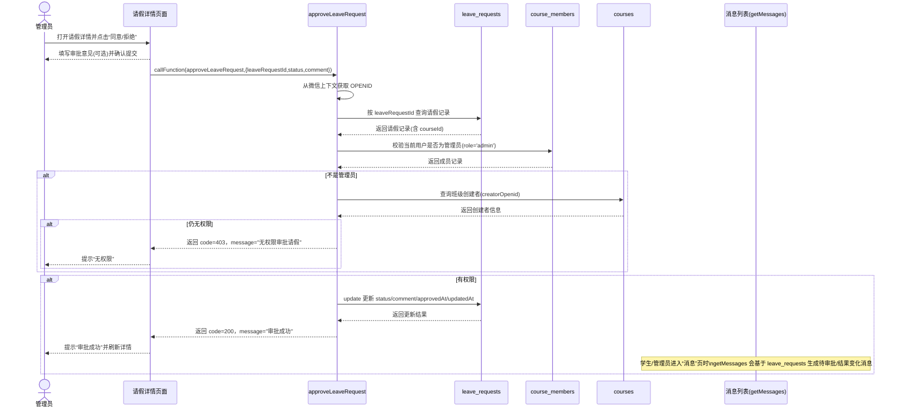
```mermaid
sequenceDiagram
    actor 管理员
    participant 详情页 as 请假详情页面
    participant 云函数 as approveLeaveRequest
    participant 请假表 as leave_requests
    participant 成员表 as course_members
    participant 班级表 as courses
    participant 消息页 as 消息列表(getMessages)

    管理员->>详情页: 打开请假详情并点击“同意/拒绝”
    详情页-->>管理员: 填写审批意见(可选)并确认提交
    详情页->>云函数: callFunction(approveLeaveRequest,{leaveRequestId,status,comment})
    云函数->>云函数: 从微信上下文获取 OPENID
    云函数->>请假表: 按 leaveRequestId 查询请假记录
    请假表-->>云函数: 返回请假记录(含 courseId)
    云函数->>成员表: 校验当前用户是否为管理员(role='admin')
    成员表-->>云函数: 返回成员记录
    alt 不是管理员
        云函数->>班级表: 查询班级创建者(creatorOpenid)
        班级表-->>云函数: 返回创建者信息
        alt 仍无权限
            云函数-->>详情页: 返回 code=403，message="无权限审批请假"
            详情页-->>管理员: 提示“无权限”
        end
    end
    alt 有权限
        云函数->>请假表: update 更新 status/comment/approvedAt/updatedAt
        请假表-->>云函数: 返回更新结果
        云函数-->>详情页: 返回 code=200，message="审批成功"
        详情页-->>管理员: 提示“审批成功”并刷新详情
        note over 消息页: 学生/管理员进入“消息”页时\ngetMessages 会基于 leave_requests 生成待审批/结果变化消息
    end
```

### 3.3.6 签到管理功能

- 用例描述：发起签到与查看记录
- 执行者：管理员
- 前置条件：管理员进入签到页面
- 后置条件：生成签到任务；或显示签到记录列表与统计
- 基本路径（发起签到码）：
  1. 管理员进入签到页面，点击“生成签到码”
  2. 填写签到提示（可选）
  3. 点击生成
  4. 前端生成 4 位随机数字签到码，并设置默认 5 分钟有效期
  5. 前端调用云函数 `generateCheckInCode`，后台校验管理员权限并写入签到码记录
  6. 页面展示当前签到码与剩余时间
- 基本路径（查看/删除签到记录）：
  1. 管理员在签到页面点击“查看签到记录”
  2. 页面调用云函数 `getCheckInRecords` 获取历史签到码与成员签到情况
  3. 管理员可左滑删除某条签到记录（对应签到码），前端调用云函数 `deleteCheckInCode` 删除签到码及其关联签到记录

签到管理功能的简要时序图（生成签到码）： 

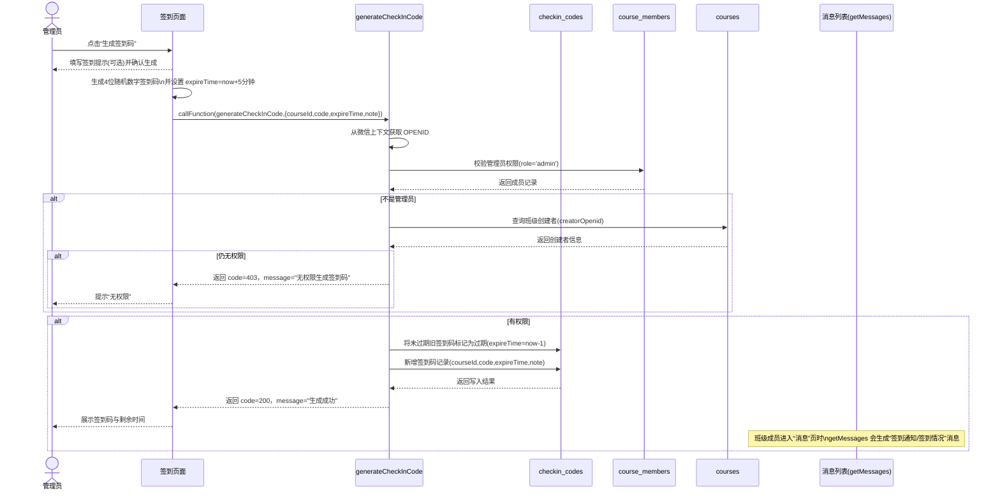
```mermaid
sequenceDiagram
    actor 管理员
    participant 签到页 as 签到页面
    participant 云函数 as generateCheckInCode
    participant 码表 as checkin_codes
    participant 成员表 as course_members
    participant 班级表 as courses
    participant 消息页 as 消息列表(getMessages)

    管理员->>签到页: 点击“生成签到码”
    签到页-->>管理员: 填写签到提示(可选)并确认生成
    签到页->>签到页: 生成4位随机数字签到码\n并设置 expireTime=now+5分钟
    签到页->>云函数: callFunction(generateCheckInCode,{courseId,code,expireTime,note})
    云函数->>云函数: 从微信上下文获取 OPENID
    云函数->>成员表: 校验管理员权限(role='admin')
    成员表-->>云函数: 返回成员记录
    alt 不是管理员
        云函数->>班级表: 查询班级创建者(creatorOpenid)
        班级表-->>云函数: 返回创建者信息
        alt 仍无权限
            云函数-->>签到页: 返回 code=403，message="无权限生成签到码"
            签到页-->>管理员: 提示“无权限”
        end
    end
    alt 有权限
        云函数->>码表: 将未过期旧签到码标记为过期(expireTime=now-1)
        云函数->>码表: 新增签到码记录(courseId,code,expireTime,note)
        码表-->>云函数: 返回写入结果
        云函数-->>签到页: 返回 code=200，message="生成成功"
        签到页-->>管理员: 展示签到码与剩余时间
        note over 消息页: 班级成员进入“消息”页时\ngetMessages 会生成“签到通知/签到情况”消息
    end
```

签到管理功能的简要时序图（查看/删除签到记录）： 

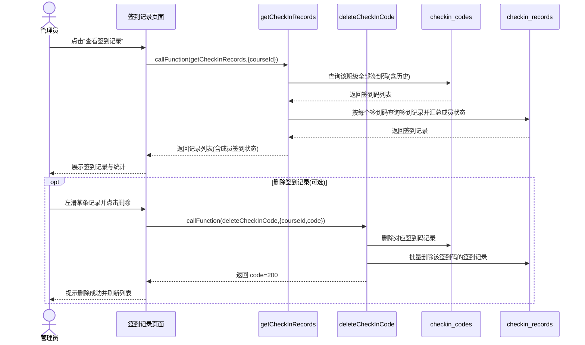
```mermaid
sequenceDiagram
    actor 管理员
    participant 记录页 as 签到记录页面
    participant 列表云函数 as getCheckInRecords
    participant 删除云函数 as deleteCheckInCode
    participant 码表 as checkin_codes
    participant 记录表 as checkin_records

    管理员->>记录页: 点击“查看签到记录”
    记录页->>列表云函数: callFunction(getCheckInRecords,{courseId})
    列表云函数->>码表: 查询该班级全部签到码(含历史)
    码表-->>列表云函数: 返回签到码列表
    列表云函数->>记录表: 按每个签到码查询签到记录并汇总成员状态
    记录表-->>列表云函数: 返回签到记录
    列表云函数-->>记录页: 返回记录列表(含成员签到状态)
    记录页-->>管理员: 展示签到记录与统计

    opt 删除签到记录(可选)
        管理员->>记录页: 左滑某条记录并点击删除
        记录页->>删除云函数: callFunction(deleteCheckInCode,{courseId,code})
        删除云函数->>码表: 删除对应签到码记录
        删除云函数->>记录表: 批量删除该签到码的签到记录
        删除云函数-->>记录页: 返回 code=200
        记录页-->>管理员: 提示删除成功并刷新列表
    end
```

## 3.4 非功能需求分析

### 3.4.1 性能需求

- 页面加载时间：常用页面加载时间不超过 3 秒。
- 接口响应时间：常用接口响应时间不超过 2 秒。
- 列表查询：常用列表支持分页加载，每页建议 20 条；避免一次性加载过多数据。
- 并发能力：满足班级场景下至少 100 名用户同时在线的使用需求。

### 3.4.2 安全需求

- 认证与权限：用户必须登录后才能访问系统；管理员操作需校验其在目标班级中的管理员身份。
- 数据隔离：不同班级的数据相互隔离，成员仅可访问所属班级数据。
- 敏感数据保护：学号/工号/手机号、请假原因、成绩与评语等需加密存储；传输应使用微信通道/HTTPS。
- 位置隐私：定位签到需获得用户授权，仅在业务需要范围内收集与展示位置数据。

### 3.4.3 可用性与兼容性需求

- 易用性：关键流程（加入班级、提交作业、发起请假、签到）操作步骤清晰，反馈及时。
- 兼容性：兼容 iOS/Android 微信环境与主流屏幕尺寸。
- 可靠性：关键写操作失败需提供重试与错误提示，避免重复提交造成脏数据。

### 3.4.4 可维护性需求

- 代码规范：遵循 ESLint 与 Prettier 约束，保证风格统一。
- 文档：提供需求、接口、数据库与部署文档，便于维护与二次开发。
- 监控与日志（可扩展）：关键操作与异常应记录日志，便于定位问题。

## 3.5 系统可行性分析

传统的人工/分散工具管理方式难以满足班级事务高频、强时效、需要留痕与统计的需求。微信小程序具有“免安装、触达成本低、使用便捷”的优势；结合微信云开发提供的云函数与云数据库能力，能够在较低运维成本下快速交付与迭代。本项目以班级为数据边界，功能聚焦通知、作业、请假、签到与沟通等核心场景，具备较强的落地可行性与推广价值。

## 3.6 本章小结

本章从用户角色、学生与管理员的功能需求、以及性能与安全等非功能需求角度，系统化给出了本项目的需求分析，并以“信息删除”等关键管理用例展示了用例描述、基本路径与简要时序图，为后续系统设计、实现与测试提供依据。

