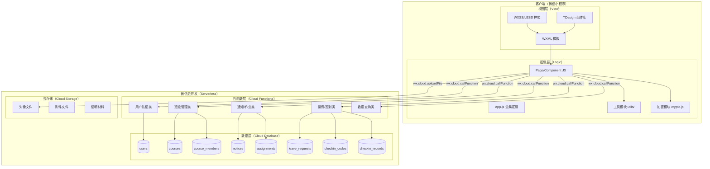
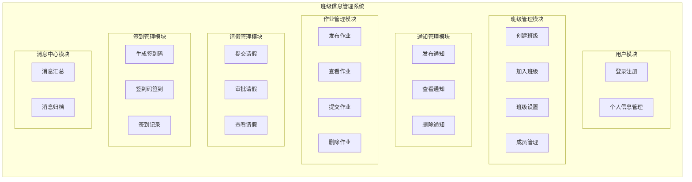
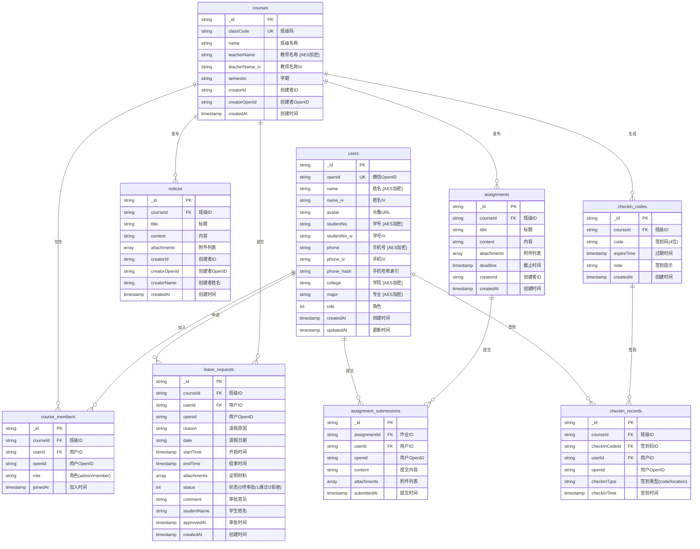
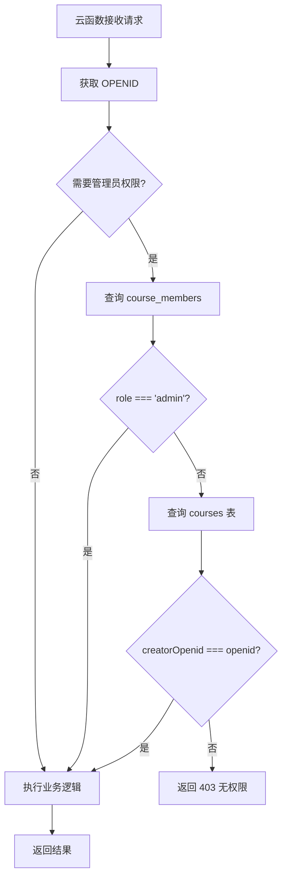
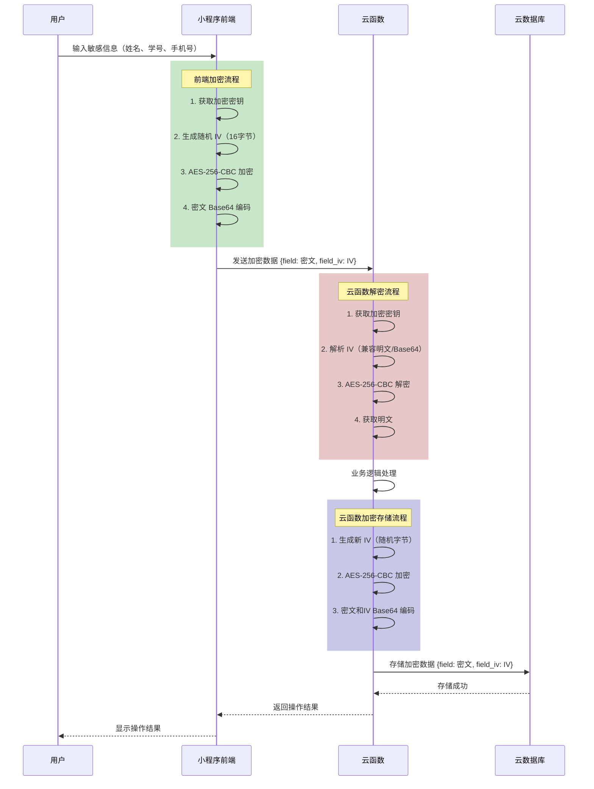

# 第四章 系统设计与实现

## 4.1 系统总体设计

### 4.1.1 系统架构设计

本系统采用微信小程序 + 微信云开发的技术架构，实现前后端分离的 Serverless 架构模式。整体架构分为四层：视图层、逻辑层、云函数层和数据库层。



**各层职责说明**：

| 层级 | 职责 | 技术实现 |
|-----|------|---------|
| **视图层** | 负责页面展示与用户交互 | WXML + WXSS/LESS + TDesign 组件库 |
| **逻辑层** | 处理业务逻辑、数据绑定、事件响应 | JavaScript (ES6+)、加密模块、事件总线 |
| **云函数层** | 执行后端业务逻辑、权限校验、数据加解密 | Node.js 云函数、wx-server-sdk |
| **数据层** | 数据持久化存储 | 微信云数据库（MongoDB 兼容） |
| **存储层** | 文件存储（头像、附件等） | 微信云存储 |

### 4.1.2 系统功能模块划分

基于第三章的需求分析，系统划分为以下功能模块：



**模块与页面对应关系**：

| 功能模块 | 前端页面 | 云函数 |
|---------|---------|--------|
| 用户模块 | `login/login`、`my/index`、`my/info-edit/index` | `login`、`getUserInfo`、`updateUserInfo` |
| 班级管理 | `class/create`、`class/info`、`class/members`、`class/settings` | `createClass`、`getClassDetail`、`getClassMembers`、`joinClass`、`exitClass` |
| 通知管理 | `class/notices`、`class/notice-detail`、`class/notice-create` | `getNotices`、`getNoticeDetail`、`createNotice`、`deleteNotice` |
| 作业管理 | `class/assignments`、`class/assignment-detail`、`class/assignment-create`、`class/assignment-submit` | `getAssignments`、`getAssignmentDetail`、`createAssignment`、`submitAssignment`、`deleteAssignment` |
| 请假管理 | `class/leave`、`class/leave-detail`、`class/leave-create` | `getLeaveRequests`、`getLeaveRequestDetail`、`createLeaveRequest`、`approveLeaveRequest` |
| 签到管理 | `class/attendance`、`class/attendance-records`、`class/attendance-record-detail` | `generateCheckInCode`、`checkInByCode`、`getCheckInRecords`、`deleteCheckInCode` |
| 消息中心 | `home/index`、`home/archived/index` | `getMessages` |

---

## 4.2 数据库设计

### 4.2.1 数据库表结构设计

系统使用微信云数据库（基于 MongoDB），共设计 8 个核心数据集合。下图展示核心表之间的关系：



### 4.2.2 数据关系与索引设计

**核心索引设计**：

| 集合 | 索引字段 | 索引类型 | 用途 |
|-----|---------|---------|------|
| users | openid | 唯一索引 | 用户登录查询 |
| users | phone_hash | 普通索引 | 手机号查询（哈希匹配） |
| courses | classCode | 唯一索引 | 班级码查询 |
| course_members | courseId + openid | 复合唯一索引 | 成员关系查询、防重复加入 |
| notices | courseId + createdAt | 复合索引 | 班级通知列表查询 |
| assignments | courseId + deadline | 复合索引 | 班级作业列表查询 |
| leave_requests | courseId + status | 复合索引 | 请假列表查询 |
| checkin_codes | courseId + expireTime | 复合索引 | 有效签到码查询 |
| checkin_records | checkInCodeId + userId | 复合唯一索引 | 防重复签到 |

### 4.2.3 数据加密存储方案

系统采用 AES-256-CBC 算法对敏感字段进行加密存储，加密字段汇总如下：

| 数据集合 | 加密字段 | 说明 |
|---------|---------|------|
| users | name, studentNo, phone, college, major, teacherNo | 用户个人敏感信息 |
| courses | teacherName | 教师姓名 |

**加密存储格式**：
- 每个加密字段存储密文（Base64 编码）
- 每个加密字段对应一个 `_iv` 后缀字段存储初始向量
- 手机号额外存储 `phone_hash`（SHA-256 哈希）用于查询

**示例**：
```json
{
  "_id": "user_001",
  "openid": "oXXXXX",
  "name": "U2FsdGVkX1+ABC123...",
  "name_iv": "aBcDeFgHiJkLmNoP",
  "phone": "U2FsdGVkX1+XYZ789...",
  "phone_iv": "qRsTuVwXyZ012345",
  "phone_hash": "e3b0c44298fc1c149afbf4c8996fb92427ae41e4649b934ca495991b7852b855"
}
```

---

## 4.3 前端设计与实现

### 4.3.1 页面布局与组件设计

#### 4.3.1.1 TDesign 组件库集成

系统采用腾讯 TDesign 微信小程序组件库，提供统一的视觉风格和交互体验。主要使用的组件包括：

| 组件类型 | 组件名称 | 使用场景 |
|---------|---------|---------|
| 导航组件 | t-navbar | 页面顶部导航栏 |
| 表单组件 | t-input、t-textarea、t-picker | 信息录入 |
| 按钮组件 | t-button | 操作按钮 |
| 列表组件 | t-cell、t-cell-group | 列表展示 |
| 反馈组件 | t-toast、t-dialog、t-message | 操作反馈 |
| 展示组件 | t-avatar、t-tag、t-icon | 信息展示 |

#### 4.3.1.2 关键页面布局

**消息中心页面（home/index）**：

```
┌─────────────────────────────────┐
│  消息中心（TabBar 首页）          │
├─────────────────────────────────┤
│  ┌─────────────────────────────┐│
│  │ [通知] 班级A - 新通知标题    ││
│  │ 内容摘要...         2分钟前 ││
│  └─────────────────────────────┘│
│  ┌─────────────────────────────┐│
│  │ [作业] 班级B - 作业标题      ││
│  │ 截止时间: 2026-01-25   未提交 ││
│  └─────────────────────────────┘│
│  ┌─────────────────────────────┐│
│  │ [签到] 班级A - 签到通知      ││
│  │ 请在5分钟内完成签到     未签到 ││
│  └─────────────────────────────┘│
├─────────────────────────────────┤
│  [消息]    [班级]    [我的]      │
└─────────────────────────────────┘
```

**班级列表页面（message/index）**：

```
┌─────────────────────────────────┐
│  班级                           │
├─────────────────────────────────┤
│  [加入班级]  [创建班级]  [隐藏班级] │
├─────────────────────────────────┤
│  ┌─────────────────────────────┐│
│  │ 📚 高等数学(2025春)          ││
│  │ 教师: 张老师    成员: 45人   ││
│  │ [通知] [作业] [请假] [签到]  ││
│  └─────────────────────────────┘│
│  ┌─────────────────────────────┐│
│  │ 📚 大学英语(2025春)          ││
│  │ 教师: 李老师    成员: 50人   ││
│  │ [通知] [作业] [请假] [签到]  ││
│  └─────────────────────────────┘│
├─────────────────────────────────┤
│  [消息]    [班级]    [我的]      │
└─────────────────────────────────┘
```

### 4.3.2 关键业务逻辑实现

#### 4.3.2.1 加密模块集成

前端加密模块位于 `utils/crypto.js`，基于 crypto-js 库实现 AES-256-CBC 加密。

**加密流程**：

```javascript
// utils/crypto.js 核心实现
const CryptoJS = require('crypto-js');

// AES-256-CBC 加密
function encryptAES(plaintext, key, iv) {
  const fullKey = key.padEnd(32, '0').slice(0, 32);
  const encrypted = CryptoJS.AES.encrypt(plaintext, CryptoJS.enc.Utf8.parse(fullKey), {
    iv: CryptoJS.enc.Utf8.parse(iv),
    mode: CryptoJS.mode.CBC,
    padding: CryptoJS.pad.Pkcs7,
  });
  return encrypted.toString();
}

// 批量加密指定字段
async function encryptFields(data, fields) {
  const result = { ...data };
  for (const field of fields) {
    if (result[field] !== undefined && result[field] !== null) {
      const { encrypted, iv } = await encrypt(result[field]);
      result[field] = encrypted;
      result[`${field}_iv`] = iv;
    }
  }
  return result;
}
```

**在个人信息编辑页面的使用**：

```javascript
// pages/my/info-edit/index.js
import { encryptFields } from '~/utils/crypto';

async onSaveInfo() {
  // 1. 收集表单数据
  const formData = {
    name: this.data.name,
    studentNo: this.data.studentNo,
    phone: this.data.phone,
    college: this.data.college,
    major: this.data.major,
  };
  
  // 2. 对敏感字段进行 AES 加密
  const encryptedData = await encryptFields(formData, 
    ['name', 'studentNo', 'phone', 'college', 'major']
  );
  
  // 3. 调用云函数更新用户信息
  const res = await wx.cloud.callFunction({
    name: 'updateUserInfo',
    data: encryptedData,
  });
  
  if (res.result.code === 200) {
    wx.showToast({ title: '保存成功', icon: 'success' });
  }
}
```

#### 4.3.2.2 事件总线通信

系统使用事件总线（eventBus）实现跨页面通信，如作业提交后通知列表页刷新：

```javascript
// utils/eventBus.js
class EventBus {
  constructor() {
    this.events = {};
  }
  
  on(eventName, callback) {
    if (!this.events[eventName]) {
      this.events[eventName] = [];
    }
    this.events[eventName].push(callback);
  }
  
  emit(eventName, data) {
    if (this.events[eventName]) {
      this.events[eventName].forEach(callback => callback(data));
    }
  }
  
  off(eventName, callback) {
    if (this.events[eventName]) {
      this.events[eventName] = this.events[eventName].filter(cb => cb !== callback);
    }
  }
}

export default new EventBus();
```

**使用示例**：

```javascript
// 作业提交页面 - 触发事件
import eventBus from '~/utils/eventBus';
eventBus.emit('assignment-submitted', { assignmentId: this.data.assignmentId });

// 作业列表页面 - 监听事件
onLoad() {
  eventBus.on('assignment-submitted', this.refreshList.bindthis));
}
onUnload() {
  eventBus.off('assignment-submitted', this.refreshList);
}
```

---

## 4.4 后端云函数设计与实现

### 4.4.1 云函数架构设计

系统共实现 35 个云函数，按功能分类如下：

| 分类 | 云函数名称 | 功能说明 |
|-----|-----------|---------|
| **用户认证** | login | 用户登录（OpenID 自动注册） |
| | register | 用户注册（预留） |
| | getUserInfo | 获取用户信息 |
| | updateUserInfo | 更新用户信息 |
| **班级管理** | createClass | 创建班级 |
| | getClassList | 获取班级列表 |
| | getClassDetail | 获取班级详情 |
| | updateClass | 更新班级信息 |
| | joinClass | 加入班级 |
| | exitClass | 退出班级 |
| **成员管理** | getClassMembers | 获取班级成员 |
| | addClassMember | 添加成员 |
| | removeClassMember | 移除成员 |
| | setClassAdmin | 设置管理员 |
| | unsetClassAdmin | 取消管理员 |
| | checkAdminStatus | 检查管理员状态 |
| **通知管理** | createNotice | 发布通知 |
| | getNotices | 获取通知列表 |
| | getNoticeDetail | 获取通知详情 |
| | deleteNotice | 删除通知 |
| **作业管理** | createAssignment | 发布作业 |
| | getAssignments | 获取作业列表 |
| | getAssignmentDetail | 获取作业详情 |
| | submitAssignment | 提交作业 |
| | deleteAssignment | 删除作业 |
| **请假管理** | createLeaveRequest | 提交请假 |
| | getLeaveRequests | 获取请假列表 |
| | getLeaveRequestDetail | 获取请假详情 |
| | approveLeaveRequest | 审批请假 |
| **签到管理** | generateCheckInCode | 生成签到码 |
| | getCheckInCode | 获取当前签到码 |
| | checkInByCode | 签到码签到 |
| | checkInByLocation | 定位签到（预留） |
| | getCheckInRecords | 获取签到记录 |
| | deleteCheckInCode | 删除签到码 |
| | updateCheckInStatus | 更新签到状态 |
| **消息中心** | getMessages | 获取消息汇总 |
| **文件处理** | getFileTempUrl | 获取文件临时链接 |
| **测试工具** | seedTestUsers | 生成测试数据 |

### 4.4.2 关键云函数实现

#### 4.4.2.1 用户登录云函数（login）

```javascript
// cloudfunctions/login/index.js
const cloud = require('wx-server-sdk');
cloud.init({ env: cloud.DYNAMIC_CURRENT_ENV });
const db = cloud.database();
const users = db.collection('users');

exports.main = async (event) => {
  try {
    // 1. 获取微信上下文中的 OpenID
    const wxContext = cloud.getWXContext();
    const openid = wxContext.OPENID;

    if (!openid) {
      return { code: 401, message: '获取微信信息失败，请重试' };
    }

    // 2. 根据 openid 查找用户
    const userRes = await users.where({ openid }).get();
    
    let user;
    let userId;

    if (userRes.data.length === 0) {
      // 3. 用户不存在，自动创建新用户
      const newUser = {
        openid,
        name: '',
        avatar: '',
        role: 0,
        createdAt: Date.now(),
        updatedAt: Date.now(),
      };
      
      const addRes = await users.add({ data: newUser });
      userId = addRes._id;
      user = { _id: userId, ...newUser };
    } else {
      // 4. 用户已存在，直接返回
      [user] = userRes.data;
      userId = user._id;
    }

    // 5. 返回登录结果
    return {
      code: 200,
      success: true,
      message: '登录成功',
      data: {
        userId: userId,
        role: user.role || 0,
      },
    };
  } catch (e) {
    console.error('login error:', e);
    return { code: 500, message: '登录失败', error: e.message };
  }
};
```

#### 4.4.2.2 更新用户信息云函数（updateUserInfo）

该云函数演示了完整的加密数据处理流程：前端加密 → 云函数解密 → 业务处理 → 重新加密 → 存储。

```javascript
// cloudfunctions/updateUserInfo/index.js
const cloud = require('wx-server-sdk');
const { decryptFields, encryptFieldsForDB } = require('./common/aes');

cloud.init({ env: cloud.DYNAMIC_CURRENT_ENV });
const db = cloud.database();
const users = db.collection('users');

exports.main = async (event) => {
  try {
    const wxContext = cloud.getWXContext();
    const openid = wxContext.OPENID;

    // 1. 解密前端传来的加密字段
    const input = decryptFields(event, ['name', 'studentNo', 'college', 'major', 'phone']);
    
    // 2. 查找用户
    const userRes = await users.where({ openid }).get();
    if (userRes.data.length === 0) {
      return { code: 404, message: '用户不存在' };
    }
    const userId = userRes.data[0]._id;

    // 3. 构建更新数据
    let updateData = { updatedAt: Date.now() };
    const sensitiveFields = [];
    
    // 处理各字段（avatar 不加密）
    if (input.avatar !== undefined) {
      updateData.avatar = String(input.avatar).trim();
    }
    if (input.name !== undefined) {
      updateData.name = String(input.name).trim();
      sensitiveFields.push('name');
    }
    if (input.phone !== undefined) {
      updateData.phone = String(input.phone).trim();
      sensitiveFields.push('phone');
      // 生成手机号哈希用于查询
      const crypto = require('crypto');
      updateData.phone_hash = crypto.createHash('sha256').update(updateData.phone).digest('hex');
    }
    // ... 其他字段类似处理
    
    // 4. 写库前重新加密敏感字段
    if (sensitiveFields.length > 0) {
      updateData = encryptFieldsForDB(updateData, sensitiveFields);
    }

    // 5. 更新数据库
    await users.doc(userId).update({ data: updateData });

    return { code: 200, success: true, message: '更新成功' };
  } catch (e) {
    console.error('updateUserInfo error:', e);
    return { code: 500, message: '更新失败', error: e.message };
  }
};
```

#### 4.4.2.3 请假审批云函数（approveLeaveRequest）

该云函数演示了管理员权限校验的实现方式：

```javascript
// cloudfunctions/approveLeaveRequest/index.js
const cloud = require('wx-server-sdk');
cloud.init({ env: cloud.DYNAMIC_CURRENT_ENV });
const db = cloud.database();
const leaveRequests = db.collection('leave_requests');
const courses = db.collection('courses');
const courseMembers = db.collection('course_members');

exports.main = async (event) => {
  try {
    const wxContext = cloud.getWXContext();
    const openid = wxContext.OPENID;
    const { leaveRequestId, status, comment } = event;

    // 1. 参数校验
    if (!leaveRequestId) {
      return { code: 400, message: '请假ID不能为空' };
    }

    // 2. 获取请假信息
    const leaveRes = await leaveRequests.doc(leaveRequestId).get();
    if (!leaveRes.data) {
      return { code: 404, message: '请假不存在' };
    }
    const courseId = leaveRes.data.courseId;

    // 3. 权限校验：检查是否为管理员
    let isAdmin = false;
    
    // 方式1：检查 course_members 表中的 role
    const memberRes = await courseMembers.where({
      courseId: courseId,
      openid: openid,
    }).get();
    isAdmin = memberRes.data.length > 0 && memberRes.data[0].role === 'admin';

    // 方式2：检查是否为班级创建者
    if (!isAdmin) {
      const courseRes = await courses.doc(courseId).get();
      if (courseRes.data && courseRes.data.creatorOpenid === openid) {
        isAdmin = true;
      }
    }

    if (!isAdmin) {
      return { code: 403, message: '无权限审批请假' };
    }

    // 4. 更新请假状态
    await leaveRequests.doc(leaveRequestId).update({
      data: {
        status: status,  // 1: 通过, 2: 拒绝
        comment: comment ? comment.trim() : '',
        approvedAt: Date.now(),
        updatedAt: Date.now(),
      },
    });

    return { code: 200, success: true, message: '审批成功' };
  } catch (e) {
    console.error('approveLeaveRequest error:', e);
    return { code: 500, message: '审批失败', error: e.message };
  }
};
```

#### 4.4.2.4 生成签到码云函数（generateCheckInCode）

```javascript
// cloudfunctions/generateCheckInCode/index.js
const cloud = require('wx-server-sdk');
cloud.init({ env: cloud.DYNAMIC_CURRENT_ENV });
const db = cloud.database();
const checkInCodes = db.collection('checkin_codes');
const courseMembers = db.collection('course_members');
const courses = db.collection('courses');

exports.main = async (event) => {
  try {
    const wxContext = cloud.getWXContext();
    const openid = wxContext.OPENID;
    const { courseId, code, expireTime, note } = event;

    // 1. 参数校验
    if (!courseId || !code) {
      return { code: 400, message: '参数不完整' };
    }

    // 2. 权限校验（同上）
    // ... 省略权限校验代码

    // 3. 将之前的签到码标记为过期
    const now = Date.now();
    await checkInCodes.where({
      courseId: courseId,
      expireTime: db.command.gt(now),
    }).update({
      data: { expireTime: now - 1 },
    });

    // 4. 创建新签到码
    await checkInCodes.add({
      data: {
        courseId: courseId,
        code: code,
        expireTime: expireTime,  // 默认 5 分钟有效期
        note: note || '',
        createdAt: Date.now(),
      },
    });

    return { code: 200, success: true, message: '生成成功' };
  } catch (e) {
    console.error('generateCheckInCode error:', e);
    return { code: 500, message: '生成签到码失败', error: e.message };
  }
};
```

### 4.4.3 权限校验机制实现

系统采用统一的权限校验模式，核心逻辑如下：



**权限校验代码模板**：

```javascript
// 通用权限校验函数
async function checkAdminPermission(openid, courseId) {
  // 1. 检查成员表中的角色
  const memberRes = await courseMembers.where({
    courseId: courseId,
    openid: openid,
  }).get();
  
  if (memberRes.data.length > 0 && memberRes.data[0].role === 'admin') {
    return true;
  }
  
  // 2. 检查是否为班级创建者
  try {
    const courseRes = await courses.doc(courseId).get();
    if (courseRes.data && courseRes.data.creatorOpenid === openid) {
      return true;
    }
  } catch (e) {
    console.error('查询班级失败:', e);
  }
  
  return false;
}
```

---

## 4.5 AES 加密模块实现

### 4.5.1 加密方案设计

#### 4.5.1.1 加密参数配置

| 参数 | 值 | 说明 |
|-----|-----|------|
| 算法 | AES-256-CBC | 高强度对称加密算法 |
| 密钥长度 | 256 位（32 字节） | 密钥不足时右侧补 0 |
| IV 长度 | 128 位（16 字节） | 每次加密随机生成 |
| 填充方式 | PKCS#7 | 标准填充模式 |
| 编码方式 | Base64 | 密文和 IV 的存储格式 |

#### 4.5.1.2 前后端加密解密流程



### 4.5.2 加密模块集成

#### 4.5.2.1 前端加密模块（utils/crypto.js）

```javascript
// 核心加密函数
const CryptoJS = require('crypto-js');

// 生成随机 IV
function generateIV() {
  const chars = 'ABCDEFGHIJKLMNOPQRSTUVWXYZabcdefghijklmnopqrstuvwxyz0123456789';
  let iv = '';
  for (let i = 0; i < 16; i++) {
    iv += chars.charAt(Math.floor(Math.random() * chars.length));
  }
  return iv;
}

// AES-256-CBC 加密
function encryptAES(plaintext, key, iv) {
  if (!plaintext) return '';
  
  const fullKey = key.padEnd(32, '0').slice(0, 32);
  const encrypted = CryptoJS.AES.encrypt(plaintext, CryptoJS.enc.Utf8.parse(fullKey), {
    iv: CryptoJS.enc.Utf8.parse(iv),
    mode: CryptoJS.mode.CBC,
    padding: CryptoJS.pad.Pkcs7,
  });
  return encrypted.toString();  // Base64 编码的密文
}

// 批量加密指定字段
async function encryptFields(data, fields) {
  const result = { ...data };
  const key = await getEncryptionKey();
  
  for (const field of fields) {
    if (result[field] !== undefined && result[field] !== null) {
      const iv = generateIV();
      result[field] = encryptAES(String(result[field]), key, iv);
      result[`${field}_iv`] = iv;
    }
  }
  return result;
}
```

#### 4.5.2.2 后端加密模块（common/aes.js）

```javascript
// 云函数端加密模块
const crypto = require('crypto');

const ENCRYPTION_KEY = (process.env.ENCRYPTION_KEY || 'a9F$3dL!8kPz2xQw')
  .padEnd(32, '0').slice(0, 32);
const ALGORITHM = 'aes-256-cbc';
const IV_LENGTH = 16;

// 解密函数（兼容前端明文IV和服务端Base64 IV）
function decrypt(ciphertext, ivEncoded) {
  if (!ciphertext || !ivEncoded) return '';
  
  // 兼容两种 IV 格式
  let iv;
  if (ivEncoded.length === IV_LENGTH) {
    iv = Buffer.from(ivEncoded, 'utf8');  // 前端传来的明文 IV
  } else {
    iv = Buffer.from(ivEncoded, 'base64');  // 服务端存储的 Base64 IV
  }
  
  const decipher = crypto.createDecipheriv(ALGORITHM, Buffer.from(ENCRYPTION_KEY, 'utf8'), iv);
  let decrypted = decipher.update(ciphertext, 'base64', 'utf8');
  decrypted += decipher.final('utf8');
  return decrypted;
}

// 加密函数（用于存储）
function encrypt(plaintext) {
  const iv = crypto.randomBytes(IV_LENGTH);
  const cipher = crypto.createCipheriv(ALGORITHM, Buffer.from(ENCRYPTION_KEY, 'utf8'), iv);
  let encrypted = cipher.update(String(plaintext), 'utf8', 'base64');
  encrypted += cipher.final('base64');
  return { ciphertext: encrypted, iv: iv.toString('base64') };
}

// 批量解密字段
function decryptFields(payload, fields) {
  const data = { ...payload };
  fields.forEach((field) => {
    if (data[field] && data[`${field}_iv`]) {
      data[field] = decrypt(data[field], data[`${field}_iv`]);
    }
  });
  return data;
}

// 批量加密字段（用于存储）
function encryptFieldsForDB(payload, fields) {
  const data = { ...payload };
  fields.forEach((field) => {
    if (data[field] != null) {
      const { ciphertext, iv } = encrypt(data[field]);
      data[field] = ciphertext;
      data[`${field}_iv`] = iv;
    }
  });
  return data;
}
```

### 4.5.3 密钥管理与安全性考虑

#### 4.5.3.1 密钥存储策略

| 环境 | 密钥来源 | 安全级别 |
|-----|---------|---------|
| 开发环境 | 配置文件（config.js） | 低 |
| 测试环境 | 环境变量 | 中 |
| 生产环境 | 云函数环境变量 / 密钥管理服务 | 高 |

#### 4.5.3.2 安全性建议

1. **密钥轮换**：建议定期更换加密密钥，配合数据迁移工具批量重新加密历史数据。

2. **密钥隔离**：前端密钥仅用于传输加密，云函数使用独立密钥进行存储加密，可进一步提升安全性。

3. **IV 唯一性**：每次加密必须使用随机 IV，禁止重复使用 IV。

4. **日志脱敏**：云函数日志中禁止打印明文敏感数据，调试时使用 `[已设置]` 占位符。

---

## 4.6 系统部署与配置

### 4.6.1 微信小程序项目配置

**project.config.json 关键配置**：

```json
{
  "appid": "wx87b7d20ff5c92995",
  "projectname": "class-information-system",
  "compileType": "miniprogram",
  "libVersion": "3.13.2",
  "cloudfunctionRoot": "cloudfunctions/",
  "setting": {
    "es6": true,
    "postcss": true,
    "minified": true,
    "enhance": true,
    "useCompilerPlugins": ["less"]
  }
}
```

**app.json 页面配置**：

```json
{
  "pages": [
    "pages/home/index",
    "pages/message/index",
    "pages/my/index"
  ],
  "subpackages": [
    {
      "root": "pages/class",
      "pages": [
        "create/index",
        "detail/index",
        "members/index",
        "notices/index",
        "assignments/index",
        "leave/index",
        "attendance/index"
      ]
    }
  ],
  "tabBar": {
    "custom": true,
    "list": [
      { "pagePath": "pages/home/index", "text": "消息" },
      { "pagePath": "pages/message/index", "text": "班级" },
      { "pagePath": "pages/my/index", "text": "我的" }
    ]
  },
  "permission": {
    "scope.userLocation": {
      "desc": "你的位置信息将用于定位签到功能"
    }
  }
}
```

### 4.6.2 云开发环境配置

**云开发环境初始化**：

1. 在微信开发者工具中开通云开发服务
2. 创建云开发环境（如：`class-info-prod`）
3. 在 `app.js` 中初始化云开发：

```javascript
// app.js
App({
  onLaunch() {
    if (!wx.cloud) {
      console.error('请使用 2.2.3 或以上的基础库以使用云能力');
    } else {
      wx.cloud.init({
        env: 'class-info-prod',  // 云开发环境 ID
        traceUser: true,
      });
    }
  },
});
```

**云函数部署**：

```bash
# 在微信开发者工具中右键点击 cloudfunctions 目录
# 选择"上传并部署：云端安装依赖"
```

### 4.6.3 数据库初始化

**创建数据集合**：

在云开发控制台中创建以下集合：

| 集合名称 | 数据权限 | 说明 |
|---------|---------|------|
| users | 仅创建者可写，所有人可读 | 用户表 |
| courses | 仅创建者可写，所有人可读 | 班级表 |
| course_members | 仅创建者可写，所有人可读 | 班级成员表 |
| notices | 仅创建者可写，所有人可读 | 通知表 |
| assignments | 仅创建者可写，所有人可读 | 作业表 |
| assignment_submissions | 仅创建者可写，所有人可读 | 作业提交表 |
| leave_requests | 仅创建者可写，所有人可读 | 请假表 |
| checkin_codes | 仅创建者可写，所有人可读 | 签到码表 |
| checkin_records | 仅创建者可写，所有人可读 | 签到记录表 |

**创建索引**（在云开发控制台 → 数据库 → 集合 → 索引管理）：

```javascript
// users 集合索引
db.collection('users').createIndex({ openid: 1 }, { unique: true });

// course_members 集合复合索引
db.collection('course_members').createIndex({ courseId: 1, openid: 1 }, { unique: true });

// checkin_records 集合复合索引
db.collection('checkin_records').createIndex({ checkInCodeId: 1, userId: 1 }, { unique: true });
```

---

## 4.7 本章小结

本章详细阐述了班级信息管理系统的设计与实现过程。在系统总体设计部分，采用微信小程序 + 云开发的 Serverless 架构，实现了前后端分离的轻量级部署方案。在数据库设计部分，基于 MongoDB 设计了 8 个核心数据集合，并针对敏感字段实施 AES-256-CBC 加密存储策略。在前端实现部分，集成 TDesign 组件库提升用户体验，并封装了加密模块和事件总线等工具。在后端实现部分，开发了 35 个云函数覆盖全部业务场景，并建立了统一的权限校验机制。最后，在加密模块部分，详细说明了前后端加解密流程和密钥管理方案。本章内容为系统的测试和运维提供了完整的技术参考。
